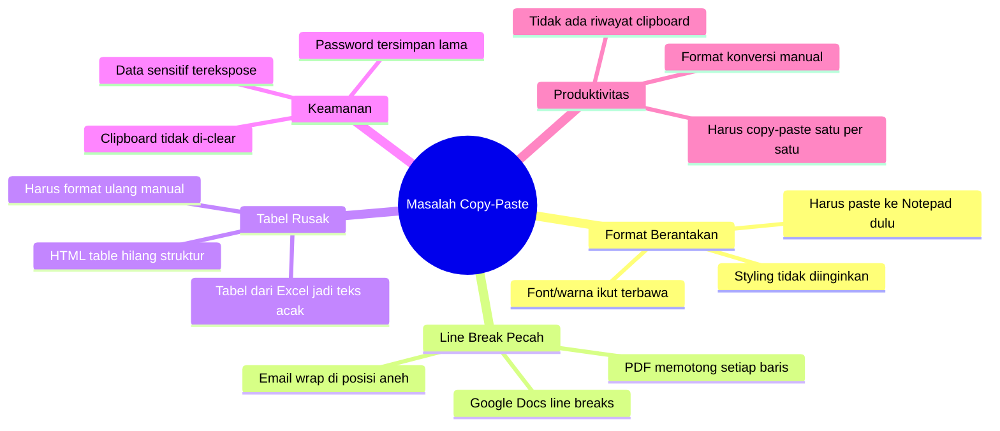
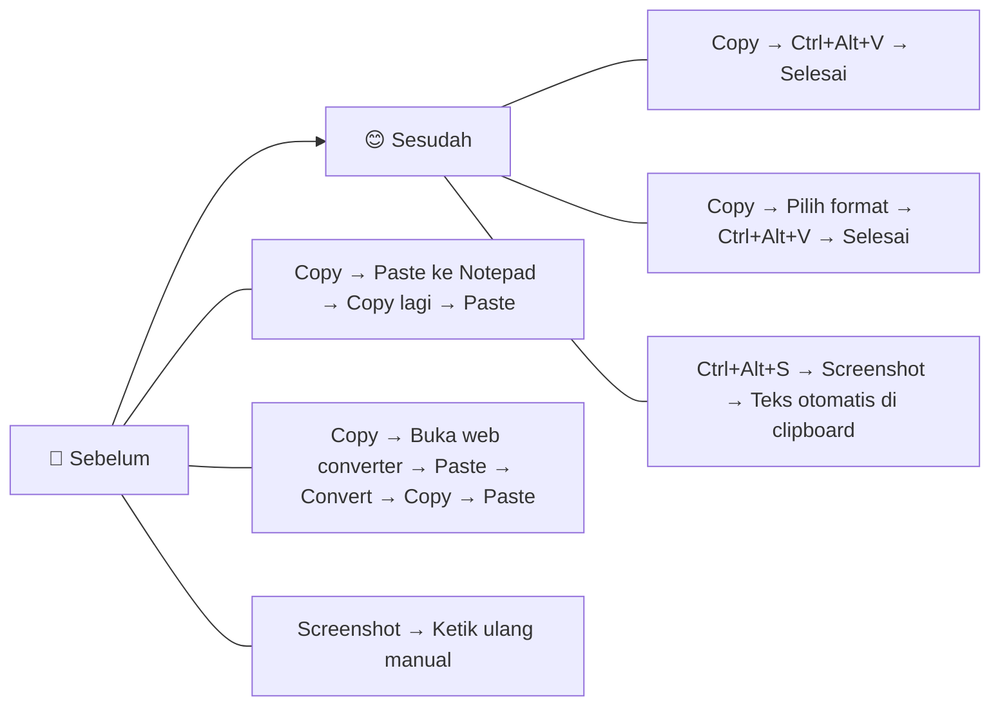
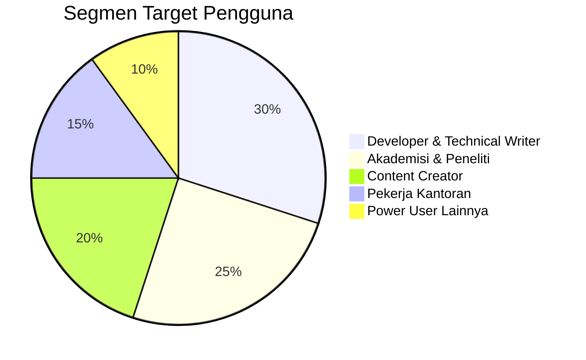
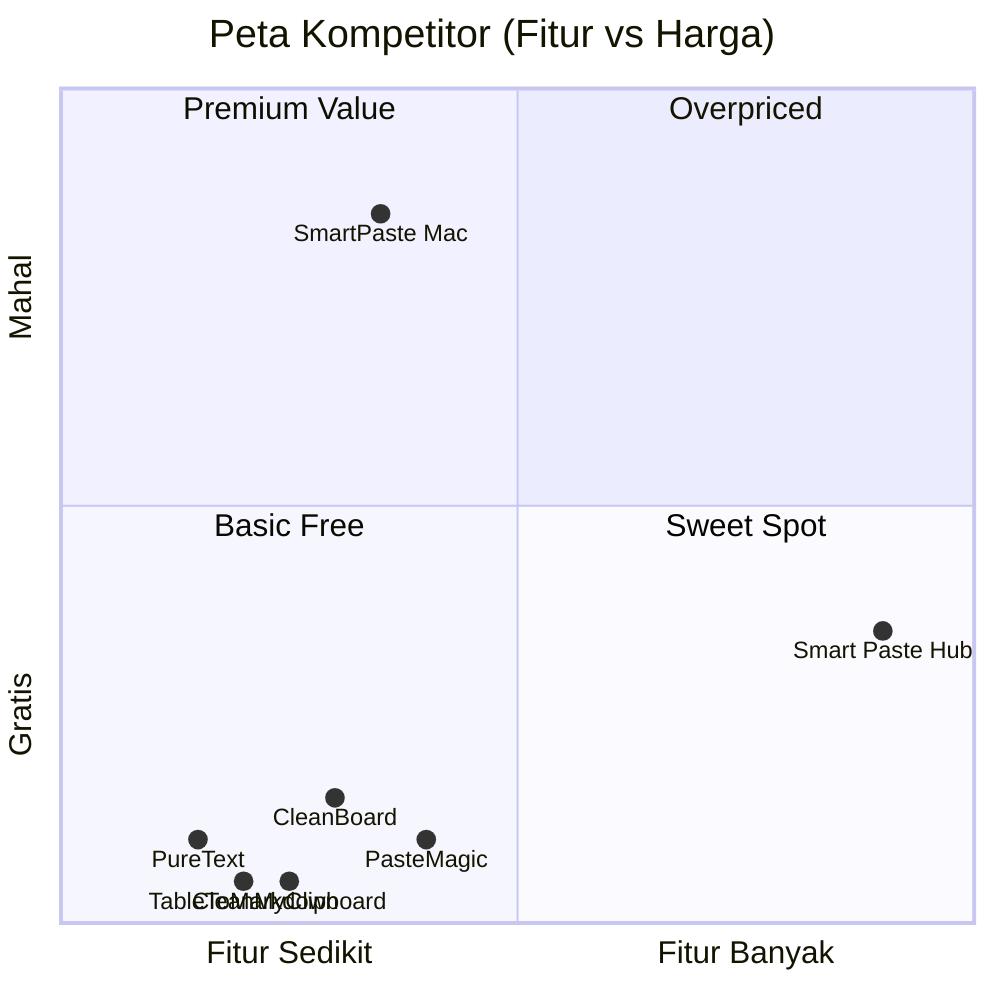
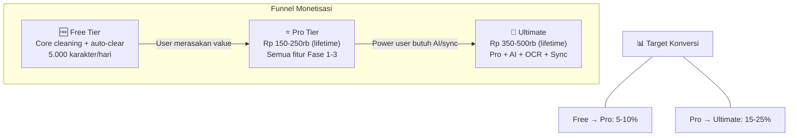

# 01 — Overview & Visi Produk

## 1.1 Apa itu Smart Paste Hub?

**Smart Paste Hub** adalah alat clipboard formatter terpadu yang berjalan sebagai desktop agent + browser extension. Tujuan utamanya: menghilangkan semua masalah copy-paste yang dialami pengguna sehari-hari — dari format berantakan, line break pecah, tabel rusak, hingga konversi format data otomatis.

## 1.2 Problem Statement

### Pain Points Spesifik

| Skenario | Masalah | Frekuensi |
|----------|---------|-----------|
| Copy dari PDF jurnal ke Word | Setiap baris jadi paragraf baru, harus gabung manual | Sangat Sering |
| Copy dari Google Docs ke InDesign | Font, warna, ukuran ikut — "menambah jam kerja" | Sering |
| Copy tabel dari web ke Markdown editor | Tabel hilang struktur, jadi teks acak | Sering |
| Copy password dari password manager | Tersimpan di clipboard tanpa batas waktu | Berbahaya |
| Developer copy JSON, perlu YAML | Harus pakai converter online terpisah | Sering |
| Copy teks dari gambar/screenshot | Tidak bisa — harus ketik ulang manual | Sangat Menyebalkan |

## 1.3 Visi Produk

> **"Satu shortcut untuk semua masalah clipboard."**

Smart Paste Hub menjadi **satu-satunya tool** yang user butuhkan untuk menangani clipboard. Bukan kumpulan fitur terpisah, tapi satu workflow yang terintegrasi.

## 1.4 Target Pengguna

### Persona Detail

| Persona | Profil | Pain Point Utama | Fitur Kunci |
|---------|--------|------------------|-------------|
| **Adi** (Developer) | Full-stack dev, VS Code user | JSON↔YAML konversi, kode kehilangan format | Format converter, syntax highlight |
| **Sari** (Peneliti) | Mahasiswa S2, banyak baca PDF | PDF line breaks pecah, tabel jurnal rusak | PDF fixer, table converter |
| **Budi** (Content Writer) | Nulis di Medium + WordPress | Rich text dari Docs berantakan | Strip format, keep structure |
| **Diana** (Admin) | Admin kantor, banyak email | Data sensitif di clipboard, copy berulang | Auto-clear, multi-clipboard |

## 1.5 Analisis Kompetitor

### Perbandingan Fitur Lengkap

| Fitur | PureText | CleanBoard | PasteMagic | SmartPaste (Mac) | **Smart Paste Hub** |
|-------|:--------:|:----------:|:----------:|:----------------:|:-------------------:|
| Strip format | ✅ | ✅ | ✅ | ✅ | ✅ |
| Keep structure (bold/italic) | ❌ | ❌ | ✅ | ✅ | ✅ |
| Fix PDF line breaks | ❌ | ❌ | ✅ | ❌ | ✅ |
| Konversi tabel | ❌ | ❌ | ❌ | ❌ | ✅ |
| JSON/YAML converter | ❌ | ❌ | ❌ | ❌ | ✅ |
| Multi-clipboard | ❌ | ❌ | ❌ | ❌ | ✅ |
| Sensitive data masker | ❌ | ❌ | ❌ | ❌ | ✅ |
| OCR paste | ❌ | ❌ | ❌ | ❌ | ✅ |
| AI rewrite | ❌ | ❌ | ❌ | ❌ | ✅ |
| Cross-device sync | ❌ | ❌ | ❌ | ❌ | ✅ |
| Browser extension | ❌ | ❌ | Web only | ❌ | ✅ |
| **Harga** | Gratis | $4.99 | Gratis | $29.99/bln | Freemium |
| **Platform** | Win | Win/Mac | Web | Mac | Win/Mac/Linux |

## 1.6 Unique Selling Points (USP)

1. **All-in-One** — Satu tool menggantikan 5+ tools terpisah
2. **Privacy-First** — Semua proses lokal, data tidak pernah keluar
3. **Smart Detection** — AI mendeteksi jenis konten dan pilih format otomatis
4. **Affordable** — Freemium dengan Pro lifetime ~Rp 150rb (vs kompetitor $30/bulan)
5. **Cross-Platform** — Windows, macOS, Linux + browser + mobile

## 1.7 Business Model

---

> **Dokumen selanjutnya:** [02 — Arsitektur Sistem](02-architecture.md)
