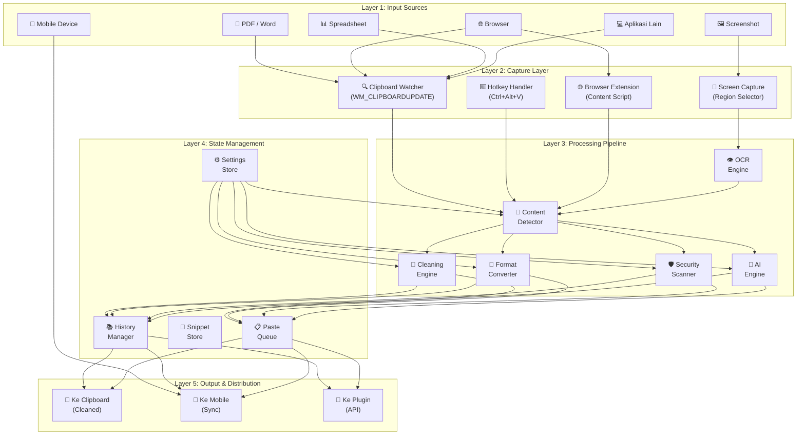
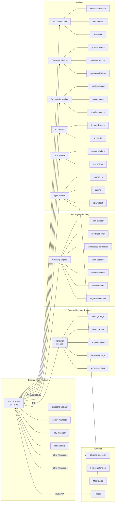
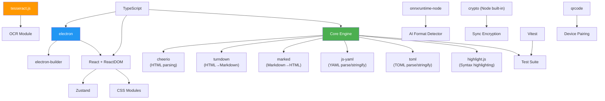
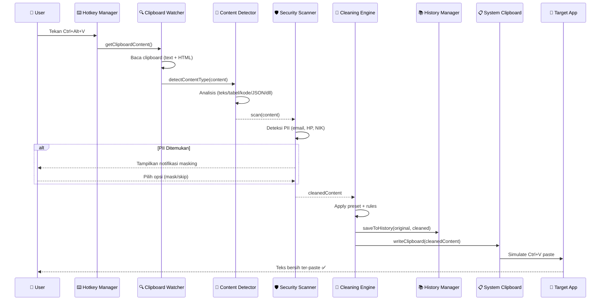
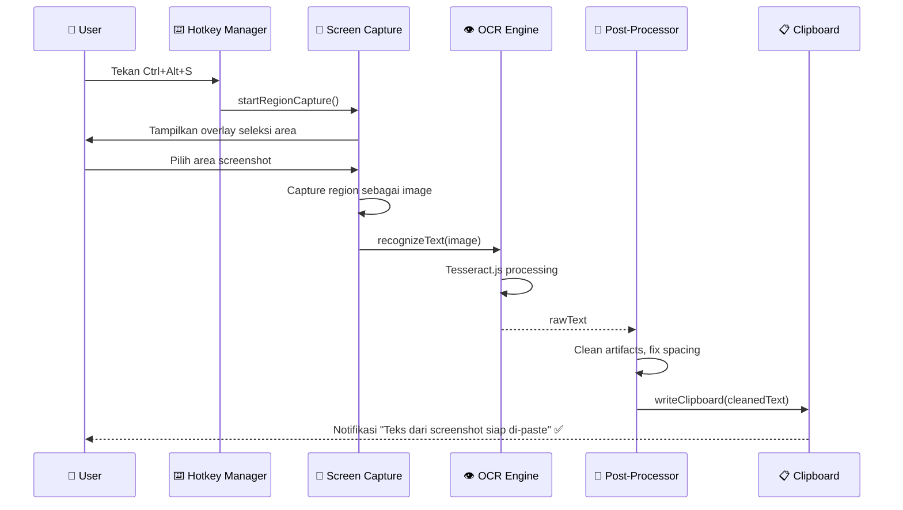
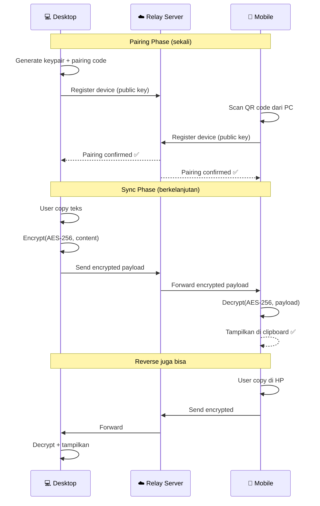
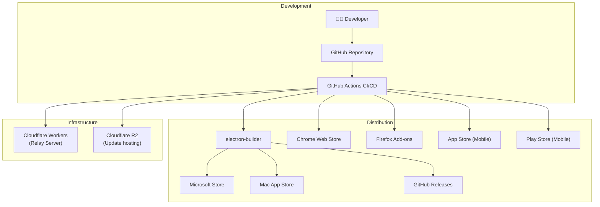

# 02 — Arsitektur Sistem

## 2.1 High-Level Architecture



## 2.2 Component Diagram



## 2.3 Tech Stack Detail

### Desktop Application

| Layer | Teknologi | Versi | Alasan Pemilihan |
|-------|-----------|-------|------------------|
| Runtime | **Electron** | 33+ | Cross-platform, akses native API clipboard |
| Language | **TypeScript** | 5.x | Type safety, DX lebih baik dari JS |
| UI Framework | **React** | 19+ | Ekosistem besar, component-based |
| State Mgmt | **Zustand** | 5.x | Ringan, simple API, cocok untuk Electron |
| Styling | **CSS Modules** | - | Scoped, tanpa build overhead |
| Build Tool | **Vite** | 6.x | HMR cepat untuk renderer process |
| Packaging | **electron-builder** | 25+ | Multi-platform packaging |
| Testing | **Vitest** | 3.x | Cepat, compatible dengan Vite |
| Linting | **ESLint** + **Prettier** | 9.x | Code quality |

### Browser Extension

| Layer | Teknologi | Alasan |
|-------|-----------|--------|
| Manifest | **Manifest V3** | Standar terbaru Chrome |
| Background | **Service Worker** | Manifest V3 requirement |
| Content Script | **TypeScript** | Konsisten dengan desktop |
| Popup UI | **React** | Reuse komponen |
| Communication | **Native Messaging** | Bridge ke desktop app |

### AI & OCR

| Layer | Teknologi | Alasan |
|-------|-----------|--------|
| OCR | **Tesseract.js** 5.x | Lokal, tanpa API, multi-bahasa |
| Local AI | **Ollama** + Phi-3/Gemma | Privacy-first, lokal |
| Cloud AI (Opsional) | **OpenAI / Gemini API** | Kualitas lebih tinggi |
| ML Detection | **ONNX Runtime** | Model ringan untuk format detection |

### Mobile & Sync

| Layer | Teknologi | Alasan |
|-------|-----------|--------|
| Mobile App | **React Native** | Share TypeScript codebase |
| Sync Protocol | **WebSocket** | Real-time, bidirectional |
| Encryption | **AES-256-GCM** | Industry standard E2E |
| Relay Server | **Cloudflare Workers** | Serverless, low-cost, global edge |

## 2.4 Dependency Graph



## 2.5 Data Flow — Proses Utama

### Flow: User Menekan Ctrl+Alt+V



### Flow: OCR Screenshot-to-Text



### Flow: Cross-Device Sync



## 2.6 Folder Structure (Final, Semua Fase)

```
smartpastehub/
├── package.json                    # Dependencies & scripts
├── electron-builder.yml            # Packaging config
├── tsconfig.json                   # TypeScript config
├── vite.config.ts                  # Vite config (renderer)
├── vitest.config.ts                # Test config
├── .eslintrc.js                    # Linting rules
├── .prettierrc                     # Formatting rules
│
├── src/
│   ├── main/                       # ── Electron Main Process ──
│   │   ├── index.ts                # Entry point
│   │   ├── clipboard-watcher.ts    # Monitor clipboard (WM_CLIPBOARDUPDATE)
│   │   ├── hotkey-manager.ts       # Global shortcut registration
│   │   ├── tray-manager.ts         # System tray icon & menu
│   │   └── ipc-handlers.ts         # IPC bridge main↔renderer
│   │
│   ├── renderer/                   # ── Electron Renderer Process (React) ──
│   │   ├── App.tsx                 # Root component + router
│   │   ├── main.tsx                # ReactDOM entry
│   │   ├── pages/
│   │   │   ├── Settings.tsx        # Settings page
│   │   │   ├── History.tsx         # History browser
│   │   │   ├── Snippets.tsx        # Snippet manager
│   │   │   ├── Templates.tsx       # Template editor
│   │   │   └── AISettings.tsx      # AI/OCR settings
│   │   ├── components/
│   │   │   ├── PresetSelector.tsx
│   │   │   ├── HotkeyConfig.tsx
│   │   │   ├── HistoryList.tsx
│   │   │   ├── SnippetCard.tsx
│   │   │   ├── TemplateEditor.tsx
│   │   │   ├── UsageMeter.tsx
│   │   │   ├── OCRPreview.tsx
│   │   │   └── RewritePreview.tsx
│   │   ├── stores/                 # Zustand stores
│   │   │   ├── settings-store.ts
│   │   │   ├── history-store.ts
│   │   │   └── ui-store.ts
│   │   └── styles/
│   │       ├── index.css           # Global styles
│   │       ├── variables.css       # Design tokens
│   │       └── components/         # Component CSS modules
│   │
│   ├── core/                       # ── Cleaning Engine ──
│   │   ├── cleaner.ts              # Main orchestrator
│   │   ├── html-stripper.ts        # Strip HTML/CSS
│   │   ├── line-break-fixer.ts     # Smart PDF merge
│   │   ├── whitespace-normalizer.ts
│   │   ├── table-detector.ts       # Detect table content
│   │   ├── table-converter.ts      # Table → Markdown/plain
│   │   ├── context-rules.ts        # Source/target routing
│   │   ├── regex-transformer.ts    # Custom regex rules
│   │   └── presets.ts              # Preset definitions
│   │
│   ├── security/                   # ── Security Module ──
│   │   ├── sensitive-detector.ts   # PII regex detection
│   │   ├── data-masker.ts          # Mask sensitive data
│   │   └── auto-clear.ts           # Timer-based clear
│   │
│   ├── converter/                  # ── Format Converters ──
│   │   ├── json-yaml-toml.ts       # JSON ↔ YAML ↔ TOML
│   │   ├── markdown-richtext.ts    # Markdown ↔ Rich Text
│   │   └── syntax-highlighter.ts   # Code → highlighted
│   │
│   ├── productivity/               # ── Productivity Features ──
│   │   ├── multi-clipboard.ts      # Multi-clipboard merge
│   │   ├── paste-queue.ts          # FIFO queue
│   │   └── template-engine.ts      # Variable substitution
│   │
│   ├── ai/                         # ── AI Engine ──
│   │   ├── format-detector.ts      # Smart content detection
│   │   ├── ai-rewriter.ts          # Grammar fix / rewrite
│   │   └── model-manager.ts        # Local model management
│   │
│   ├── ocr/                        # ── OCR Engine ──
│   │   ├── screen-capture.ts       # Region selector
│   │   ├── ocr-engine.ts           # Tesseract.js wrapper
│   │   └── ocr-post-processor.ts   # Clean OCR output
│   │
│   ├── sync/                       # ── Cross-Device Sync ──
│   │   ├── sync-manager.ts         # Sync orchestrator
│   │   ├── encryption.ts           # AES-256-GCM E2E
│   │   ├── pairing.ts              # QR code pairing
│   │   └── relay-client.ts         # WebSocket relay
│   │
│   ├── plugins/                    # ── Plugin System ──
│   │   ├── plugin-api.ts           # Plugin interface
│   │   ├── plugin-loader.ts        # Dynamic loader
│   │   └── plugin-store.ts         # Marketplace
│   │
│   └── shared/                     # ── Shared Types & Utils ──
│       ├── types.ts                # TypeScript interfaces
│       ├── constants.ts            # App constants
│       └── utils.ts                # Utility functions
│
├── extension/                      # ── Browser Extension ──
│   ├── manifest.json               # Chrome Manifest V3
│   ├── background.ts               # Service worker
│   ├── content-script.ts           # Page injection
│   ├── popup/
│   │   ├── popup.html
│   │   ├── popup.tsx
│   │   └── popup.css
│   └── native-messaging/
│       └── host-config.json
│
├── mobile/                         # ── Mobile Companion App ──
│   ├── package.json
│   ├── App.tsx
│   └── src/
│       ├── screens/
│       │   └── ClipboardSync.tsx
│       └── services/
│           └── sync-service.ts
│
├── relay-server/                   # ── Cloud Relay ──
│   ├── wrangler.toml               # Cloudflare Workers config
│   └── src/
│       └── index.ts                # WebSocket relay handler
│
├── tests/                          # ── Test Suite ──
│   ├── core/
│   ├── security/
│   ├── converter/
│   ├── productivity/
│   ├── ai/
│   ├── ocr/
│   ├── sync/
│   └── fixtures/
│
├── assets/                         # ── Static Assets ──
│   ├── icons/                      # App icons (all sizes)
│   ├── tray/                       # Tray icons
│   └── onboarding/                 # Onboarding images
│
└── docs/                           # ── Documentation ──
    ├── 00-daftar-isi.md
    ├── 01-overview.md
    ├── 02-architecture.md          # (file ini)
    └── ...
```

## 2.7 Deployment Architecture



---

> **Dokumen selanjutnya:** [03 — Backend & Core Engine](03-backend-design.md)
