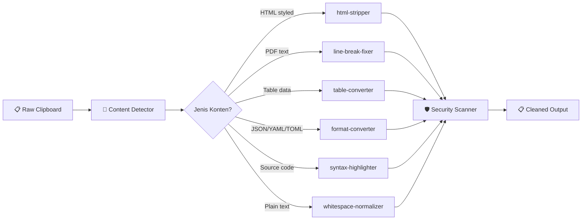
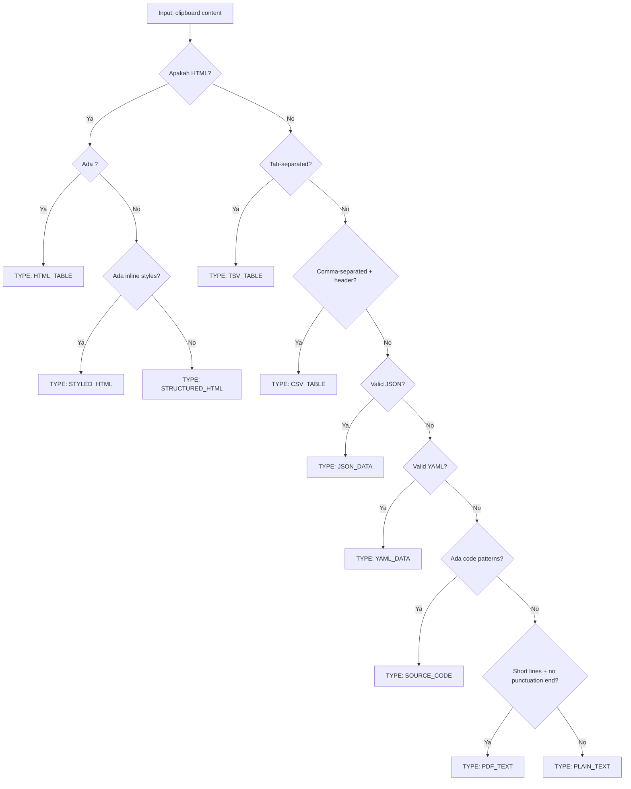
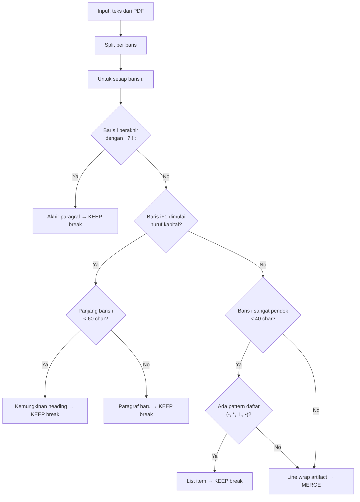
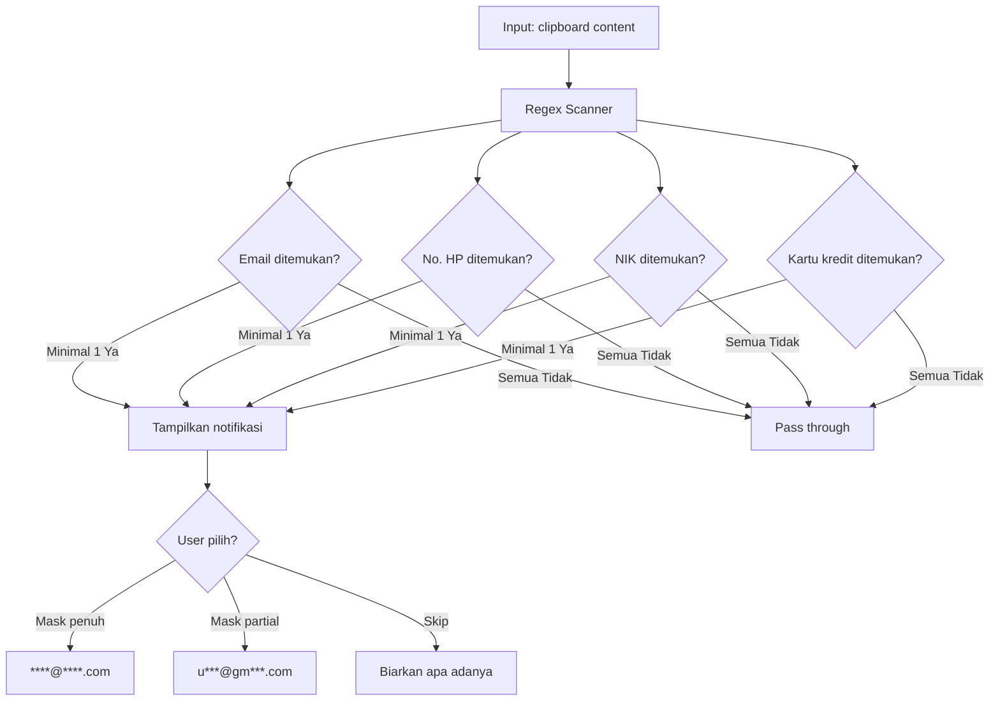
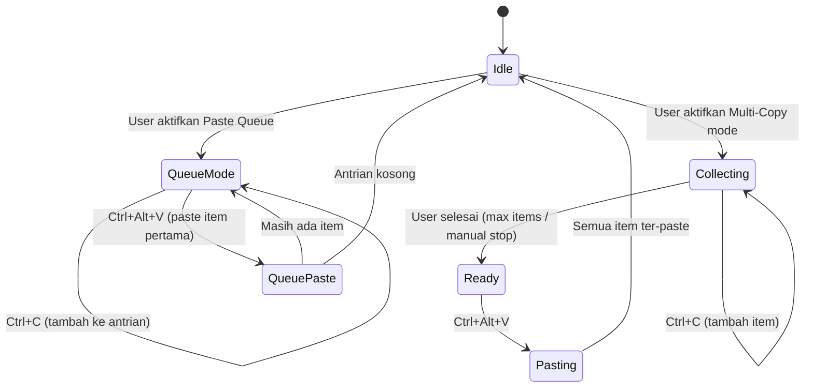
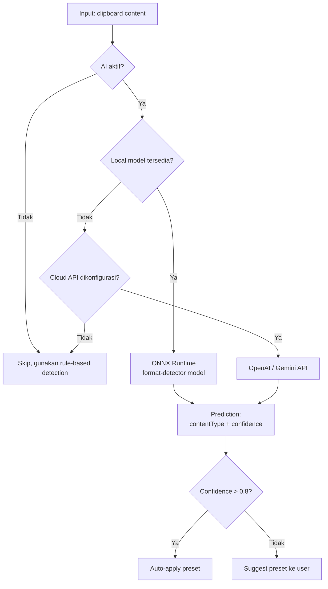
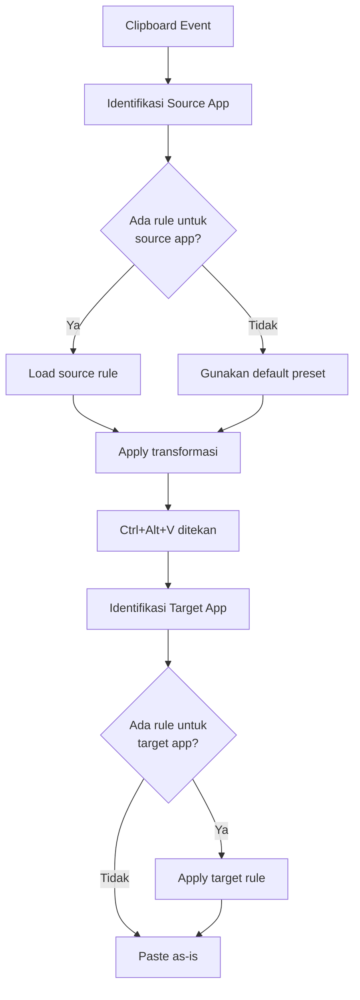

# 03 — Backend & Core Engine Design

## 3.1 Processing Pipeline



## 3.2 Content Detector — Algoritma Deteksi



### Interface Content Detector

```typescript
// src/core/content-detector.ts

enum ContentType {
  PLAIN_TEXT = 'plain_text',
  PDF_TEXT = 'pdf_text',
  STYLED_HTML = 'styled_html',
  STRUCTURED_HTML = 'structured_html',
  HTML_TABLE = 'html_table',
  TSV_TABLE = 'tsv_table',
  CSV_TABLE = 'csv_table',
  JSON_DATA = 'json_data',
  YAML_DATA = 'yaml_data',
  TOML_DATA = 'toml_data',
  SOURCE_CODE = 'source_code',
  EMAIL_TEXT = 'email_text',
  ADDRESS = 'address',
  UNKNOWN = 'unknown',
}

interface DetectionResult {
  type: ContentType;
  confidence: number;       // 0.0 - 1.0
  language?: string;        // untuk source code
  metadata: Record<string, unknown>;
}

function detectContentType(
  text: string,
  html?: string
): DetectionResult;
```

## 3.3 Cleaning Engine — Core Logic

### HTML Stripper

```typescript
// src/core/html-stripper.ts

interface StripOptions {
  keepBold: boolean;        // Pertahankan <b>/<strong>
  keepItalic: boolean;      // Pertahankan <i>/<em>
  keepLists: boolean;       // Pertahankan <ul>/<ol>/<li>
  keepLinks: boolean;       // Pertahankan <a href>
  keepHeadings: boolean;    // Pertahankan <h1>-<h6>
  keepLineBreaks: boolean;  // Pertahankan <br>/<p>
}

// Preset configurations
const PRESETS = {
  plainText: {
    keepBold: false, keepItalic: false, keepLists: false,
    keepLinks: false, keepHeadings: false, keepLineBreaks: true,
  },
  keepStructure: {
    keepBold: true, keepItalic: true, keepLists: true,
    keepLinks: true, keepHeadings: true, keepLineBreaks: true,
  },
};

function stripHTML(html: string, options: StripOptions): string;
```

### PDF Line-Break Fixer — Heuristik



```typescript
// src/core/line-break-fixer.ts

interface FixerOptions {
  minLineLength: number;     // Default: 40
  maxLineLength: number;     // Default: 80
  preserveListItems: boolean;
  preserveHeadings: boolean;
  language: 'id' | 'en';    // Affects heuristics
}

function fixLineBreaks(text: string, options?: FixerOptions): string;
```

## 3.4 Table Converter

```typescript
// src/core/table-converter.ts

interface TableData {
  headers: string[];
  rows: string[][];
  alignment?: ('left' | 'center' | 'right')[];
}

// Deteksi & parse
function parseHTMLTable(html: string): TableData;
function parseTSV(text: string): TableData;
function parseCSV(text: string): TableData;

// Konversi
function toMarkdown(table: TableData): string;
function toPlainText(table: TableData, padding?: number): string;
function toCSV(table: TableData): string;

// Contoh output Markdown:
// | Nama  | Umur | Kota     |
// |-------|------|----------|
// | Adi   | 28   | Jakarta  |
// | Sari  | 25   | Bandung  |
```

## 3.5 Format Converters

```typescript
// src/converter/json-yaml-toml.ts

type DataFormat = 'json' | 'yaml' | 'toml';

function detectFormat(text: string): DataFormat | null;
function convert(text: string, from: DataFormat, to: DataFormat): string;

// Auto-detect & convert
function autoConvert(text: string, targetFormat: DataFormat): string;
```

```typescript
// src/converter/markdown-richtext.ts

// Markdown → Rich Text (HTML with inline styles)
function markdownToRichText(markdown: string): string;

// Rich Text (HTML) → Markdown
function richTextToMarkdown(html: string): string;
```

```typescript
// src/converter/syntax-highlighter.ts

interface HighlightOptions {
  language?: string;       // Auto-detect jika tidak diset
  theme: 'dark' | 'light';
  lineNumbers: boolean;
}

// Menghasilkan HTML rich text dengan syntax highlighting
function highlightCode(code: string, options: HighlightOptions): string;
```

## 3.6 Security Module



```typescript
// src/security/sensitive-detector.ts

interface SensitiveMatch {
  type: 'email' | 'phone' | 'nik' | 'credit_card' | 'custom';
  value: string;
  startIndex: number;
  endIndex: number;
}

const PATTERNS = {
  email: /[a-zA-Z0-9._%+-]+@[a-zA-Z0-9.-]+\.[a-zA-Z]{2,}/g,
  phone_id: /(\+62|62|0)[\s-]?8[1-9][\s-]?\d{1,4}[\s-]?\d{1,4}[\s-]?\d{1,4}/g,
  nik: /\b\d{16}\b/g,
  credit_card: /\b(?:\d[ -]*?){13,19}\b/g,
};

function detectSensitiveData(text: string): SensitiveMatch[];
```

```typescript
// src/security/data-masker.ts

type MaskMode = 'full' | 'partial' | 'skip';

function maskData(
  text: string,
  matches: SensitiveMatch[],
  mode: MaskMode
): string;

// Contoh:
// full:    "email@test.com" → "****@****.***"
// partial: "email@test.com" → "e***l@t***.com"
```

## 3.7 Productivity Module

### Multi-Clipboard & Paste Queue — State Machine



```typescript
// src/productivity/multi-clipboard.ts

interface MultiClipboard {
  items: string[];
  maxItems: number;        // Default: 10
  separator: string;       // Default: '\n'
  isCollecting: boolean;
}

function startCollecting(): void;
function addItem(text: string): void;
function mergeAndPaste(separator?: string): string;
function clear(): void;
```

```typescript
// src/productivity/template-engine.ts

interface Template {
  id: string;
  name: string;
  content: string;         // "Halo {nama}, order #{id}"
  variables: string[];     // ['nama', 'id']
  tags: string[];
}

function parseTemplate(content: string): string[];
function fillTemplate(
  template: Template,
  values: Record<string, string>
): string;
```

## 3.8 AI Module



```typescript
// src/ai/format-detector.ts

interface AIDetectionResult {
  type: ContentType;
  confidence: number;
  suggestedPreset: string;
  suggestedActions: string[];
}

// Menggunakan lightweight ONNX model
async function detectWithAI(text: string): Promise<AIDetectionResult>;
```

```typescript
// src/ai/ai-rewriter.ts

type RewriteMode = 'fix_grammar' | 'rephrase' | 'summarize' | 'formalize';

interface RewriteOptions {
  mode: RewriteMode;
  language: 'id' | 'en';
  provider: 'local' | 'openai' | 'gemini';
}

async function rewriteText(
  text: string,
  options: RewriteOptions
): Promise<string>;
```

## 3.9 OCR Module

```typescript
// src/ocr/ocr-engine.ts

interface OCROptions {
  languages: string[];     // ['ind', 'eng']
  psm: number;             // Page segmentation mode
  confidence_threshold: number;
}

interface OCRResult {
  text: string;
  confidence: number;
  blocks: OCRBlock[];
}

async function recognizeText(
  image: Buffer | string,
  options?: OCROptions
): Promise<OCRResult>;
```

## 3.10 Context Rules Engine



```typescript
// src/core/context-rules.ts

interface ContextRule {
  id: string;
  name: string;
  sourceApp?: string;        // e.g., "AcroRd32.exe"
  targetApp?: string;        // e.g., "Code.exe"
  contentType?: ContentType;
  preset: string;
  transforms: Transform[];
  enabled: boolean;
}

// Contoh aturan bawaan:
const DEFAULT_RULES: ContextRule[] = [
  {
    id: 'pdf-reader-fix',
    name: 'PDF Reader → Fix Line Breaks',
    sourceApp: 'AcroRd32.exe',
    preset: 'pdfFix',
    transforms: ['fixLineBreaks', 'normalizeWhitespace'],
    enabled: true,
  },
  {
    id: 'to-vscode-markdown',
    name: 'Paste ke VS Code → Markdown Table',
    targetApp: 'Code.exe',
    contentType: ContentType.HTML_TABLE,
    preset: 'markdownTable',
    transforms: ['tableToMarkdown'],
    enabled: true,
  },
];
```

---

> **Dokumen selanjutnya:** [04 — Frontend & UI/UX](04-frontend-design.md)
