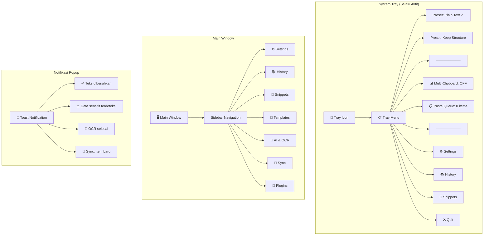
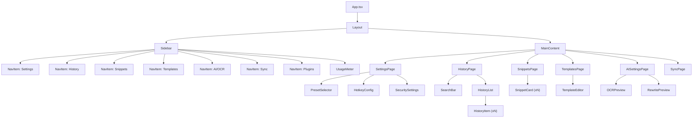
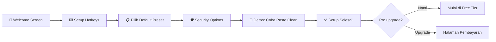

# 04 — Frontend & UI/UX Design

## 4.1 Overview Layar & Navigasi



## 4.2 Wireframe Layout — Settings Page

```
┌─────────────────────────────────────────────────────────┐
│  Smart Paste Hub                              _ □ ✕     │
├────────────┬────────────────────────────────────────────┤
│            │                                            │
│  ⚙️ Settings│  ⌨️ Hotkey Configuration                  │
│  📚 History │  ┌──────────────────────────────────────┐ │
│  📌 Snippets│  │ Paste Clean:  [Ctrl+Alt+V  ] [Edit] │ │
│  📝 Template│  │ OCR Capture:  [Ctrl+Alt+S  ] [Edit] │ │
│  🤖 AI/OCR │  │ Multi-Copy:   [Ctrl+Alt+C  ] [Edit] │ │
│  📱 Sync   │  │ Queue Toggle: [Ctrl+Alt+Q  ] [Edit] │ │
│  🔌 Plugins│  └──────────────────────────────────────┘ │
│            │                                            │
│            │  📋 Active Preset                          │
│            │  ┌──────────────────────────────────────┐ │
│            │  │ ○ Plain Text (strip semua)            │ │
│            │  │ ● Keep Structure (bold/italic/list)   │ │
│            │  │ ○ Custom Preset 1                     │ │
│            │  │   [+ Tambah Preset Baru]              │ │
│            │  └──────────────────────────────────────┘ │
│            │                                            │
│            │  🛡️ Security                               │
│            │  ┌──────────────────────────────────────┐ │
│            │  │ Deteksi data sensitif   [●━━━━ ON ]  │ │
│            │  │ Auto-clear clipboard    [━━━━● ON ]  │ │
│            │  │ Timer: [30 detik ▾]                   │ │
│            │  └──────────────────────────────────────┘ │
│            │                                            │
├────────────┴────────────────────────────────────────────┤
│  Smart Paste Hub v1.0  │  Free Tier: 3.2k/5k chars     │
└─────────────────────────────────────────────────────────┘
```

## 4.3 Wireframe — History Page

```
┌─────────────────────────────────────────────────────────┐
│  Smart Paste Hub                              _ □ ✕     │
├────────────┬────────────────────────────────────────────┤
│            │  📚 Clipboard History                      │
│  ⚙️ Settings│                                           │
│  📚 History│  🔍 [Search history...              ]     │
│  📌 Snippets│  Filter: [Semua ▾] [Hari ini ▾]         │
│  📝 Template│                                           │
│  🤖 AI/OCR │  ┌────────────────────────────────────┐   │
│  📱 Sync   │  │ 📝 14:32 - Lorem ipsum dolor sit   │   │
│  🔌 Plugins│  │    amet, consectetur adipiscing...  │   │
│            │  │    [📋 Copy] [📌 Pin] [🗑️ Delete]   │   │
│            │  ├────────────────────────────────────┤   │
│            │  │ 📊 14:28 - [Markdown Table]         │   │
│            │  │    | Nama | Umur | Kota |           │   │
│            │  │    [📋 Copy] [📌 Pin] [🗑️ Delete]   │   │
│            │  ├────────────────────────────────────┤   │
│            │  │ 🔧 14:15 - {"key": "value",...}     │   │
│            │  │    Detected: JSON                   │   │
│            │  │    [📋 Copy] [📌 Pin] [🗑️ Delete]   │   │
│            │  ├────────────────────────────────────┤   │
│            │  │ 📸 14:01 - [OCR Result]             │   │
│            │  │    "Teks dari screenshot area..."    │   │
│            │  │    [📋 Copy] [📌 Pin] [🗑️ Delete]   │   │
│            │  └────────────────────────────────────┘   │
│            │                                            │
│            │  Showing 1-20 of 47  [< Prev] [Next >]    │
├────────────┴────────────────────────────────────────────┤
│  Smart Paste Hub v1.0  │  Free Tier: 3.2k/5k chars     │
└─────────────────────────────────────────────────────────┘
```

## 4.4 Wireframe — Template Page

```
┌─────────────────────────────────────────────────────────┐
│  Smart Paste Hub                              _ □ ✕     │
├────────────┬────────────────────────────────────────────┤
│            │  📝 Template Manager                       │
│            │                                            │
│  Sidebar   │  [+ Buat Template Baru]                   │
│            │                                            │
│            │  ┌────────────────────────────────────┐   │
│            │  │ 📧 Email Formal                     │   │
│            │  │ "Yth. {nama},                       │   │
│            │  │  Dengan hormat..."                   │   │
│            │  │ Variables: nama, jabatan, perusahaan │   │
│            │  │ [✏️ Edit] [📋 Use] [🗑️]              │   │
│            │  ├────────────────────────────────────┤   │
│            │  │ 🛒 Konfirmasi Order                  │   │
│            │  │ "Halo {customer}, pesanan #{id}     │   │
│            │  │  sudah kami terima..."               │   │
│            │  │ Variables: customer, id, total       │   │
│            │  │ [✏️ Edit] [📋 Use] [🗑️]              │   │
│            │  └────────────────────────────────────┘   │
│            │                                            │
│            │  ── Template Editor ──                     │
│            │  ┌────────────────────────────────────┐   │
│            │  │ Nama: [Email Follow-up         ]   │   │
│            │  │ Tags: [email, follow-up         ]   │   │
│            │  │ ┌────────────────────────────────┐ │   │
│            │  │ │ Dear {nama},                   │ │   │
│            │  │ │                                │ │   │
│            │  │ │ Following up on {topik}...     │ │   │
│            │  │ └────────────────────────────────┘ │   │
│            │  │ Detected Variables: nama, topik     │   │
│            │  │ [💾 Simpan] [Preview]               │   │
│            │  └────────────────────────────────────┘   │
└────────────┴────────────────────────────────────────────┘
```

## 4.5 Notification Toast Design

```
┌─ Toast: Teks Dibersihkan ──────────────┐
│ ✅ Teks dibersihkan & siap di-paste     │
│ 📝 356 karakter │ Preset: Keep Struct.  │
│ ░░░░░░░░░░░░░░░░░░░░░░░░ 3s auto-close │
└─────────────────────────────────────────┘

┌─ Toast: Data Sensitif ─────────────────┐
│ ⚠️ Data sensitif terdeteksi!            │
│ 📧 2 email │ 📱 1 nomor HP              │
│ [Mask Semua] [Mask Partial] [Abaikan]  │
└─────────────────────────────────────────┘

┌─ Toast: Multi-Clipboard ───────────────┐
│ 📋 Multi-Clipboard Mode AKTIF           │
│ Item: 3/10 │ Separator: newline         │
│ [Paste Semua] [Clear] [Stop Collecting] │
└─────────────────────────────────────────┘

┌─ Toast: OCR Selesai ───────────────────┐
│ 📸 OCR: 127 karakter dikenali           │
│ Confidence: 94.2%                       │
│ "Teks dari screenshot area yang..."     │
│ [📋 Copy] [✏️ Edit] [🗑️ Buang]          │
└─────────────────────────────────────────┘
```

## 4.6 Browser Extension — Popup UI

```
┌─ Smart Paste Hub Extension ──────┐
│ ┌──────────────────────────────┐ │
│ │  🟢 Connected to Desktop App │ │
│ └──────────────────────────────┘ │
│                                  │
│ Active Preset:                   │
│ ┌──────────────────────────────┐ │
│ │ ● Plain Text                 │ │
│ │ ○ Keep Structure             │ │
│ │ ○ Markdown Table             │ │
│ └──────────────────────────────┘ │
│                                  │
│ Quick Actions:                   │
│ [📋 Paste Clean] [📸 OCR Area]   │
│                                  │
│ Last cleaned: 2 min ago          │
│ ─────────────────────────────    │
│ [⚙️ Open Full Settings]          │
└──────────────────────────────────┘
```

## 4.7 Component Tree (React)



## 4.8 Design System

### Warna

| Token | Light Mode | Dark Mode | Penggunaan |
|-------|-----------|-----------|------------|
| `--bg-primary` | `#FFFFFF` | `#1A1A2E` | Background utama |
| `--bg-secondary` | `#F5F5F5` | `#16213E` | Sidebar, cards |
| `--bg-tertiary` | `#EBEBEB` | `#0F3460` | Hover states |
| `--text-primary` | `#1A1A2E` | `#E0E0E0` | Body text |
| `--text-secondary` | `#666666` | `#A0A0A0` | Secondary text |
| `--accent-primary` | `#6C63FF` | `#7C74FF` | Buttons, links |
| `--accent-success` | `#00C853` | `#00E676` | Success toast |
| `--accent-warning` | `#FFB300` | `#FFCA28` | Warning toast |
| `--accent-danger` | `#FF3D00` | `#FF6E40` | Error, delete |

### Tipografi

| Elemen | Font | Size | Weight |
|--------|------|------|--------|
| Heading 1 | Inter | 24px | 700 |
| Heading 2 | Inter | 18px | 600 |
| Body | Inter | 14px | 400 |
| Caption | Inter | 12px | 400 |
| Code/Mono | JetBrains Mono | 13px | 400 |

### Spacing

| Token | Value | Penggunaan |
|-------|-------|------------|
| `--space-xs` | 4px | Icon padding |
| `--space-sm` | 8px | Element gap |
| `--space-md` | 16px | Section gap |
| `--space-lg` | 24px | Card padding |
| `--space-xl` | 32px | Page margin |

### Border Radius

| Token | Value | Penggunaan |
|-------|-------|------------|
| `--radius-sm` | 4px | Buttons, inputs |
| `--radius-md` | 8px | Cards |
| `--radius-lg` | 12px | Modals |
| `--radius-full` | 9999px | Badges, avatars |

## 4.9 User Flow — Onboarding



## 4.10 Mobile Companion — Screens

```
┌─────────────────────┐    ┌─────────────────────┐
│  Smart Paste Hub    │    │  Smart Paste Hub    │
│  📱 Mobile          │    │  📱 Clipboard Sync  │
│                     │    │                     │
│  ┌───────────────┐  │    │  ┌───────────────┐  │
│  │ 🔗 Status:    │  │    │  │ 📝 14:32      │  │
│  │ Connected ✅  │  │    │  │ Lorem ipsum   │  │
│  │ PC: DESKTOP-1 │  │    │  │ dolor sit...  │  │
│  └───────────────┘  │    │  │ [Copy] [Share]│  │
│                     │    │  ├───────────────┤  │
│  Recent Clipboard:  │    │  │ 📊 14:28      │  │
│  ┌───────────────┐  │    │  │ [Table Data]  │  │
│  │ 3 items synced│  │    │  │ [Copy] [Share]│  │
│  │ Last: 2m ago  │  │    │  ├───────────────┤  │
│  └───────────────┘  │    │  │ 🔧 14:15      │  │
│                     │    │  │ {"key":"val"} │  │
│  [📸 Scan QR Code]  │    │  │ [Copy] [Share]│  │
│  [⚙️ Settings]      │    │  └───────────────┘  │
│                     │    │                     │
│  ━━━━━━━━━━━━━━━━  │    │  ━━━━━━━━━━━━━━━━  │
│  🏠 Home  📋 Clips  │    │  🏠 Home  📋 Clips  │
└─────────────────────┘    └─────────────────────┘
   Home Screen                Clipboard List
```

---

> **Dokumen selanjutnya:** [05 — Database & Storage](05-database-storage.md)
