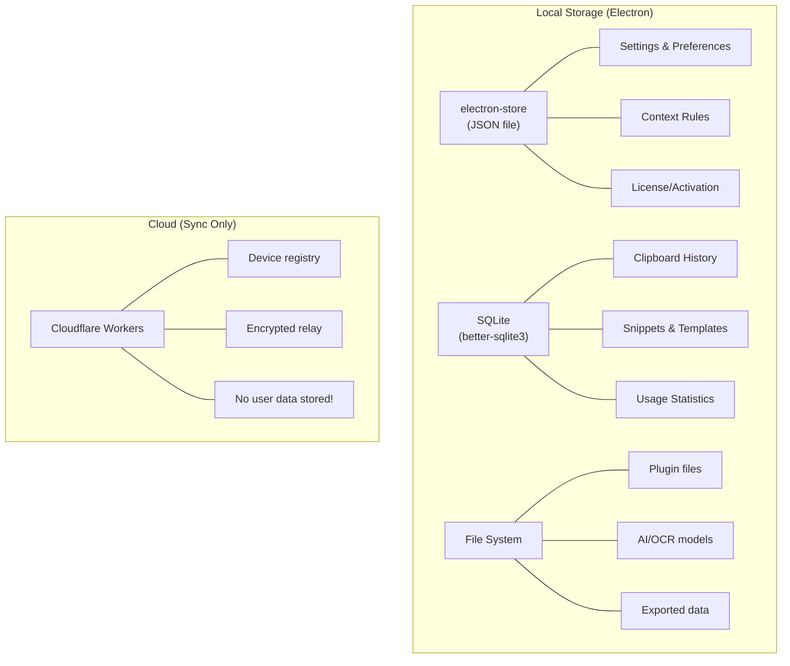
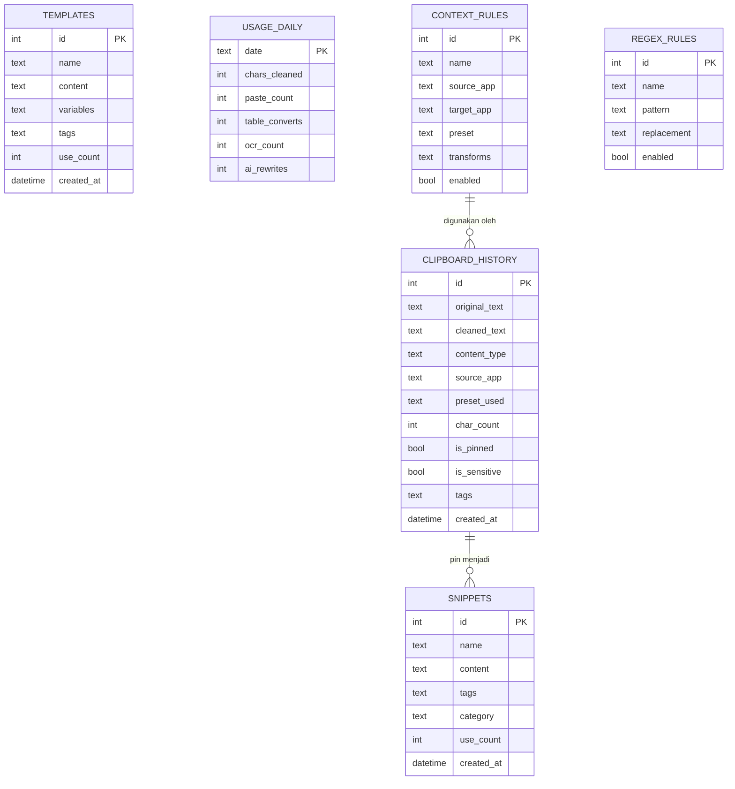
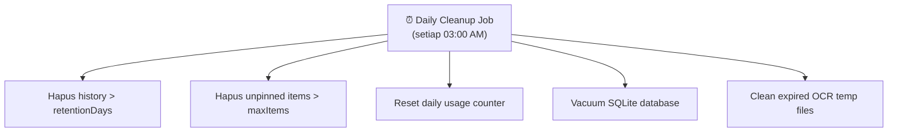

# 05 — Database & Storage Design

## 5.1 Storage Strategy

Smart Paste Hub menggunakan **local-first storage** — semua data disimpan di mesin pengguna, kecuali sync relay.



## 5.2 SQLite Schema

```sql
-- ══════════════════════════════
-- CLIPBOARD HISTORY
-- ══════════════════════════════

CREATE TABLE clipboard_history (
    id              INTEGER PRIMARY KEY AUTOINCREMENT,
    original_text   TEXT NOT NULL,
    cleaned_text    TEXT NOT NULL,
    html_content    TEXT,
    content_type    TEXT NOT NULL DEFAULT 'plain_text',
    -- Enum: plain_text, pdf_text, styled_html, html_table,
    --       json_data, yaml_data, source_code, ocr_result
    source_app      TEXT,
    preset_used     TEXT,
    char_count      INTEGER NOT NULL,
    is_pinned       INTEGER NOT NULL DEFAULT 0,
    is_sensitive    INTEGER NOT NULL DEFAULT 0,
    tags            TEXT,           -- JSON array: ["work", "code"]
    created_at      DATETIME NOT NULL DEFAULT CURRENT_TIMESTAMP
);

CREATE INDEX idx_history_created  ON clipboard_history(created_at DESC);
CREATE INDEX idx_history_type     ON clipboard_history(content_type);
CREATE INDEX idx_history_pinned   ON clipboard_history(is_pinned);

-- Full-text search
CREATE VIRTUAL TABLE history_fts USING fts5(
    original_text, cleaned_text, tags,
    content='clipboard_history',
    content_rowid='id'
);

-- ══════════════════════════════
-- SNIPPETS
-- ══════════════════════════════

CREATE TABLE snippets (
    id              INTEGER PRIMARY KEY AUTOINCREMENT,
    name            TEXT NOT NULL,
    content         TEXT NOT NULL,
    tags            TEXT,           -- JSON array
    category        TEXT,
    use_count       INTEGER NOT NULL DEFAULT 0,
    last_used_at    DATETIME,
    created_at      DATETIME NOT NULL DEFAULT CURRENT_TIMESTAMP,
    updated_at      DATETIME NOT NULL DEFAULT CURRENT_TIMESTAMP
);

CREATE INDEX idx_snippets_category ON snippets(category);

-- ══════════════════════════════
-- TEMPLATES
-- ══════════════════════════════

CREATE TABLE templates (
    id              INTEGER PRIMARY KEY AUTOINCREMENT,
    name            TEXT NOT NULL,
    content         TEXT NOT NULL,  -- "Halo {nama}, order #{id}"
    variables       TEXT NOT NULL,  -- JSON array: ["nama", "id"]
    tags            TEXT,
    use_count       INTEGER NOT NULL DEFAULT 0,
    last_used_at    DATETIME,
    created_at      DATETIME NOT NULL DEFAULT CURRENT_TIMESTAMP,
    updated_at      DATETIME NOT NULL DEFAULT CURRENT_TIMESTAMP
);

-- ══════════════════════════════
-- USAGE STATISTICS (for freemium)
-- ══════════════════════════════

CREATE TABLE usage_daily (
    date            TEXT PRIMARY KEY,  -- "2026-02-16"
    chars_cleaned   INTEGER NOT NULL DEFAULT 0,
    paste_count     INTEGER NOT NULL DEFAULT 0,
    table_converts  INTEGER NOT NULL DEFAULT 0,
    ocr_count       INTEGER NOT NULL DEFAULT 0,
    ai_rewrites     INTEGER NOT NULL DEFAULT 0
);

-- ══════════════════════════════
-- CONTEXT RULES
-- ══════════════════════════════

CREATE TABLE context_rules (
    id              INTEGER PRIMARY KEY AUTOINCREMENT,
    name            TEXT NOT NULL,
    source_app      TEXT,
    target_app      TEXT,
    content_type    TEXT,
    preset          TEXT NOT NULL,
    transforms      TEXT NOT NULL,   -- JSON array
    priority        INTEGER NOT NULL DEFAULT 0,
    enabled         INTEGER NOT NULL DEFAULT 1,
    created_at      DATETIME NOT NULL DEFAULT CURRENT_TIMESTAMP
);

-- ══════════════════════════════
-- REGEX TRANSFORM RULES
-- ══════════════════════════════

CREATE TABLE regex_rules (
    id              INTEGER PRIMARY KEY AUTOINCREMENT,
    name            TEXT NOT NULL,
    pattern         TEXT NOT NULL,   -- Regex pattern
    replacement     TEXT NOT NULL,   -- Replacement string
    flags           TEXT DEFAULT 'g',
    enabled         INTEGER NOT NULL DEFAULT 1,
    sort_order      INTEGER NOT NULL DEFAULT 0
);

-- Default regex rules
INSERT INTO regex_rules (name, pattern, replacement, flags) VALUES
    ('Hapus URL', 'https?://\S+', '', 'g'),
    ('Hapus Emoji', '[\u{1F600}-\u{1F64F}\u{1F300}-\u{1F5FF}\u{1F680}-\u{1F6FF}]', '', 'gu'),
    ('Format Nomor HP', '(\+62|62|0)(8\d{2})(\d{4})(\d{3,4})', '+62 $2-$3-$4', 'g');
```

## 5.3 Entity Relationship Diagram



## 5.4 Settings Store (electron-store)

```typescript
// Disimpan di: %APPDATA%/SmartPasteHub/config.json

interface AppSettings {
  // General
  general: {
    startOnBoot: boolean;           // Default: true
    minimizeToTray: boolean;        // Default: true
    language: 'id' | 'en';         // Default: 'id'
    theme: 'light' | 'dark' | 'system';
  };

  // Hotkeys
  hotkeys: {
    pasteClean: string;             // Default: 'CmdOrCtrl+Alt+V'
    ocrCapture: string;             // Default: 'CmdOrCtrl+Alt+S'
    multiCopy: string;              // Default: 'CmdOrCtrl+Alt+C'
    queueToggle: string;            // Default: 'CmdOrCtrl+Alt+Q'
    historyOpen: string;            // Default: 'CmdOrCtrl+Alt+H'
  };

  // Presets
  presets: {
    active: string;                 // Default: 'keepStructure'
    custom: CustomPreset[];
  };

  // Security
  security: {
    detectSensitive: boolean;       // Default: true
    autoClear: boolean;             // Default: false
    clearTimerSeconds: number;      // Default: 30
    maskMode: 'full' | 'partial';   // Default: 'partial'
  };

  // History
  history: {
    enabled: boolean;               // Default: true
    maxItems: number;               // Default: 100
    retentionDays: number;          // Default: 30
  };

  // AI
  ai: {
    enabled: boolean;               // Default: false
    provider: 'local' | 'openai' | 'gemini';
    apiKey?: string;                // Encrypted
    autoDetect: boolean;            // Default: true
  };

  // OCR
  ocr: {
    languages: string[];            // Default: ['ind', 'eng']
    autoClean: boolean;             // Default: true
  };

  // Sync
  sync: {
    enabled: boolean;               // Default: false
    deviceId: string;
    pairedDevices: PairedDevice[];
  };

  // License
  license: {
    tier: 'free' | 'pro' | 'ultimate';
    key?: string;
    activatedAt?: string;
  };
}
```

## 5.5 Data Retention & Cleanup



```typescript
// src/core/data-cleanup.ts

async function dailyCleanup(settings: AppSettings): Promise<void> {
  const { maxItems, retentionDays } = settings.history;
  
  // 1. Hapus berdasarkan umur
  await db.run(`
    DELETE FROM clipboard_history 
    WHERE created_at < datetime('now', '-${retentionDays} days')
    AND is_pinned = 0
  `);
  
  // 2. Hapus jika melebihi maxItems
  await db.run(`
    DELETE FROM clipboard_history 
    WHERE id NOT IN (
      SELECT id FROM clipboard_history 
      WHERE is_pinned = 0 
      ORDER BY created_at DESC 
      LIMIT ${maxItems}
    ) AND is_pinned = 0
  `);
  
  // 3. Rebuild FTS index
  await db.run(`INSERT INTO history_fts(history_fts) VALUES('rebuild')`);
  
  // 4. Vacuum
  await db.run('VACUUM');
}
```

---

> **Dokumen selanjutnya:** [06 — API & Komunikasi](06-api-design.md)
