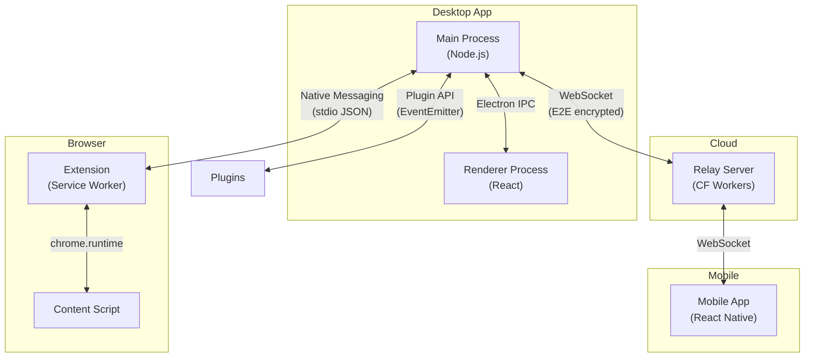
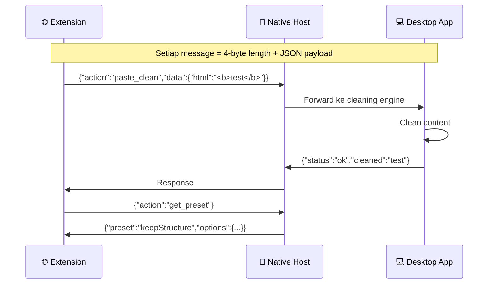
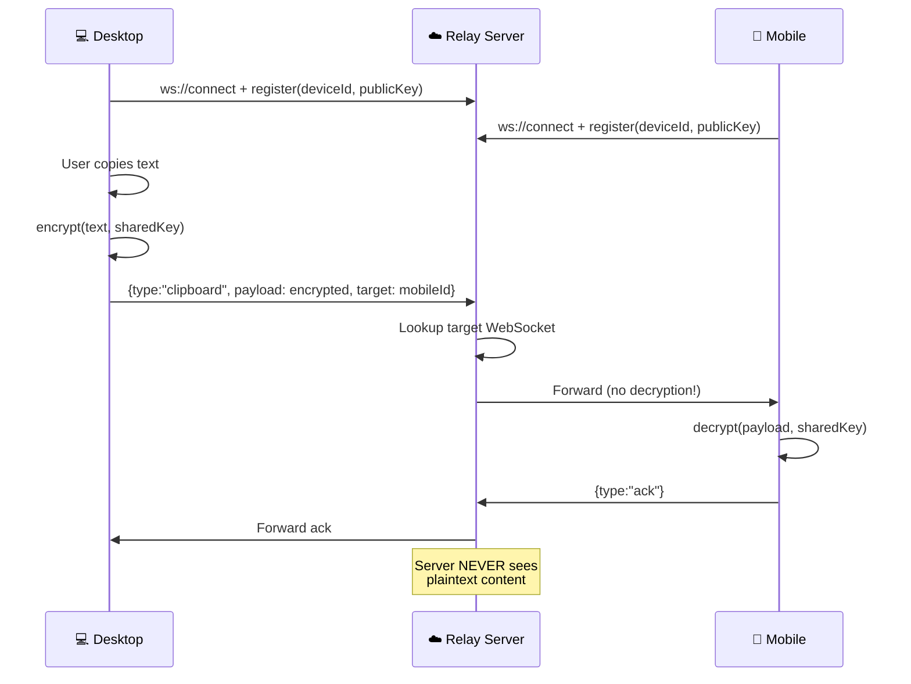

# 06 — API & Komunikasi

## 6.1 Overview Komunikasi Antar Komponen



## 6.2 Electron IPC — Main ↔ Renderer

### Channel Map

| Channel | Direction | Payload | Deskripsi |
|---------|-----------|---------|-----------|
| `clipboard:content` | Main→Renderer | `{text, html, type}` | Clipboard berubah |
| `clipboard:cleaned` | Main→Renderer | `{original, cleaned, type}` | Setelah dibersihkan |
| `clipboard:paste` | Renderer→Main | `{preset, transforms}` | User minta paste |
| `settings:get` | Renderer→Main | - | Ambil semua settings |
| `settings:update` | Renderer→Main | `Partial<AppSettings>` | Update settings |
| `history:list` | Renderer→Main | `{page, search, filter}` | List history |
| `history:pin` | Renderer→Main | `{id, pinned}` | Pin/unpin item |
| `history:delete` | Renderer→Main | `{id}` | Hapus item |
| `snippet:list` | Renderer→Main | `{category}` | List snippets |
| `snippet:create` | Renderer→Main | `{name, content, tags}` | Buat snippet |
| `template:fill` | Renderer→Main | `{id, values}` | Fill template |
| `security:alert` | Main→Renderer | `{matches, text}` | PII terdeteksi |
| `security:mask` | Renderer→Main | `{mode}` | Mask/skip pilihan |
| `ocr:start` | Renderer→Main | - | Mulai OCR capture |
| `ocr:result` | Main→Renderer | `{text, confidence}` | Hasil OCR |
| `ai:detect` | Main→Renderer | `{type, confidence}` | AI detection result |
| `ai:rewrite` | Renderer→Main | `{text, mode}` | Minta AI rewrite |
| `sync:status` | Main→Renderer | `{connected, devices}` | Status sync |
| `multi:status` | Main→Renderer | `{count, mode}` | Multi-clipboard status |
| `usage:stats` | Main→Renderer | `UsageDaily` | Statistik hari ini |

### TypeScript Interface

```typescript
// src/shared/ipc-types.ts

// IPC event map untuk type safety
interface IPCEvents {
  // Clipboard
  'clipboard:content': { text: string; html?: string; type: ContentType };
  'clipboard:cleaned': { original: string; cleaned: string; type: ContentType };
  'clipboard:paste': { preset: string; transforms: string[] };

  // Security
  'security:alert': { matches: SensitiveMatch[]; text: string };
  'security:mask': { mode: MaskMode; matches: SensitiveMatch[] };

  // OCR
  'ocr:start': void;
  'ocr:result': { text: string; confidence: number; error?: string };

  // AI
  'ai:detect': { type: ContentType; confidence: number };
  'ai:rewrite': { text: string; mode: RewriteMode };
  'ai:result': { original: string; rewritten: string };

  // Sync
  'sync:status': { connected: boolean; devices: PairedDevice[] };
  'sync:incoming': { text: string; fromDevice: string };
}
```

## 6.3 Native Messaging — Desktop ↔ Browser Extension

### Protocol



### Message Format

```typescript
// Extension → Desktop
interface ExtToDesktopMessage {
  action: 'paste_clean' | 'get_preset' | 'set_preset' | 
          'get_history' | 'ocr_capture';
  data?: Record<string, unknown>;
  requestId: string;  // Untuk match response
}

// Desktop → Extension
interface DesktopToExtMessage {
  requestId: string;
  status: 'ok' | 'error';
  data?: Record<string, unknown>;
  error?: string;
}
```

### Native Host Manifest

```json
// native-messaging/com.smartpastehub.host.json
{
  "name": "com.smartpastehub.host",
  "description": "Smart Paste Hub Native Messaging Host",
  "path": "C:\\Program Files\\SmartPasteHub\\native-host.exe",
  "type": "stdio",
  "allowed_origins": [
    "chrome-extension://EXTENSION_ID_HERE/"
  ]
}
```

## 6.4 Plugin API

```typescript
// src/plugins/plugin-api.ts

interface SmartPastePlugin {
  // Metadata
  name: string;
  version: string;
  description: string;
  author: string;

  // Lifecycle
  onActivate(api: PluginAPI): void;
  onDeactivate(): void;
}

interface PluginAPI {
  // Clipboard hooks
  onBeforeClean(callback: (content: ClipboardContent) => ClipboardContent): void;
  onAfterClean(callback: (content: ClipboardContent) => ClipboardContent): void;

  // Register custom transform
  registerTransform(name: string, fn: (text: string) => string): void;

  // Register custom preset
  registerPreset(preset: CustomPreset): void;

  // Register context rule
  registerContextRule(rule: ContextRule): void;

  // UI hooks
  registerSettingsPanel(component: React.ComponentType): void;

  // Storage (scoped per plugin)
  storage: {
    get(key: string): Promise<unknown>;
    set(key: string, value: unknown): Promise<void>;
  };

  // Logging
  log: {
    info(message: string): void;
    warn(message: string): void;
    error(message: string): void;
  };
}

// Contoh plugin:
const myPlugin: SmartPastePlugin = {
  name: 'remove-tracking-params',
  version: '1.0.0',
  description: 'Hapus UTM tracking parameters dari URL',
  author: 'Community',

  onActivate(api) {
    api.registerTransform('removeUTM', (text) => {
      return text.replace(/[?&](utm_\w+)=[^&\s]*/g, '');
    });
  },
  onDeactivate() {},
};
```

## 6.5 Sync Protocol — WebSocket

```typescript
// Relay server message format
interface SyncMessage {
  type: 'register' | 'pair' | 'clipboard' | 'ack' | 'ping';
  deviceId: string;
  targetDeviceId?: string;
  payload: string;           // AES-256-GCM encrypted
  nonce: string;             // 12-byte nonce (base64)
  timestamp: number;
}
```



## 6.6 Relay Server — Cloudflare Workers

```typescript
// relay-server/src/index.ts

export default {
  async fetch(request: Request, env: Env): Promise<Response> {
    if (request.headers.get('Upgrade') === 'websocket') {
      return handleWebSocket(request, env);
    }
    return new Response('Smart Paste Hub Relay', { status: 200 });
  },
};

// WebSocket handler
async function handleWebSocket(request: Request, env: Env) {
  const [client, server] = Object.values(new WebSocketPair());

  server.accept();
  server.addEventListener('message', async (event) => {
    const msg: SyncMessage = JSON.parse(event.data as string);

    switch (msg.type) {
      case 'register':
        // Simpan deviceId → WebSocket mapping di Durable Object
        await env.DEVICES.get(
          env.DEVICES.idFromName('registry')
        ).fetch(/* register */);
        break;

      case 'clipboard':
        // Forward encrypted payload ke target device
        // Server TIDAK pernah mendekripsi
        const targetWs = await getDeviceSocket(msg.targetDeviceId);
        targetWs?.send(JSON.stringify(msg));
        break;

      case 'ping':
        server.send(JSON.stringify({ type: 'pong' }));
        break;
    }
  });

  return new Response(null, { status: 101, webSocket: client });
}
```

---

> **Dokumen selanjutnya:** [07 — Keamanan & Privasi](07-security-privacy.md)
