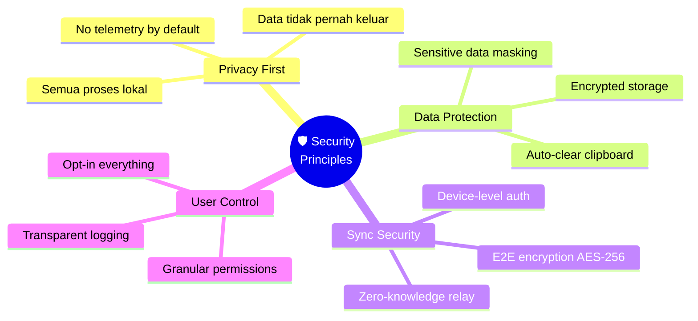
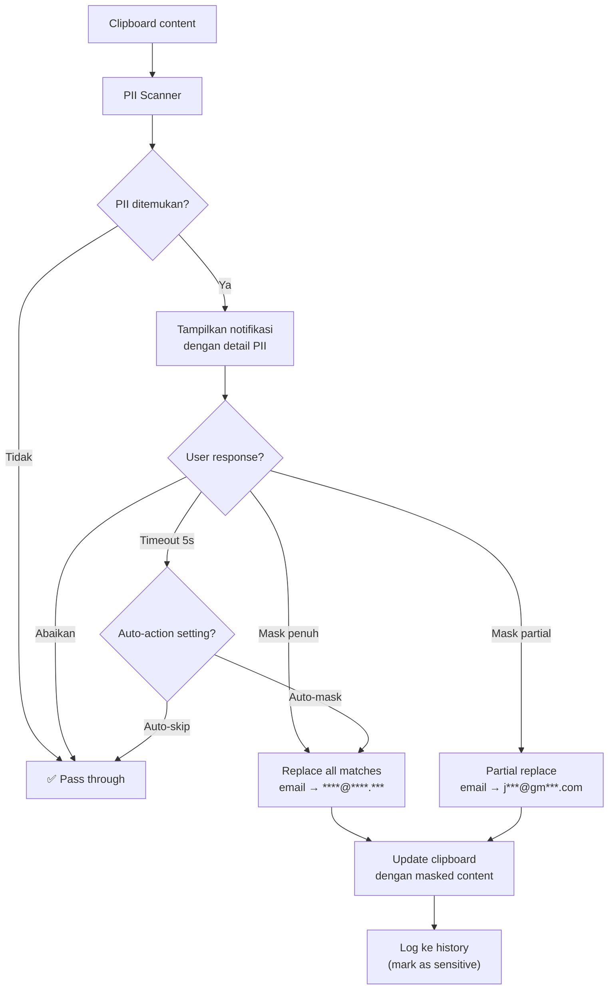
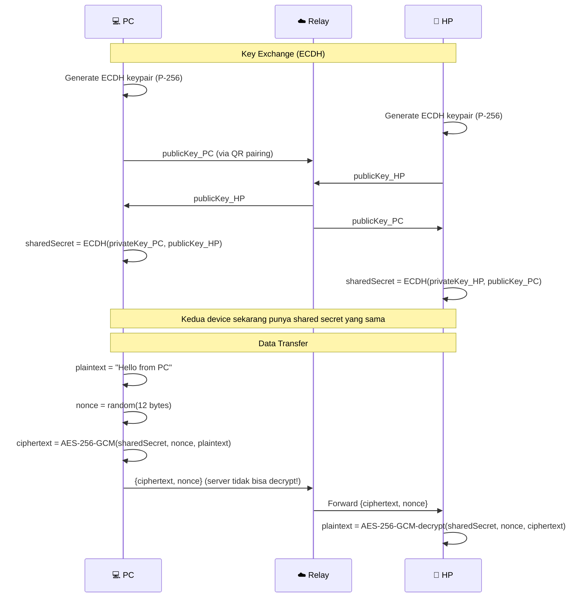
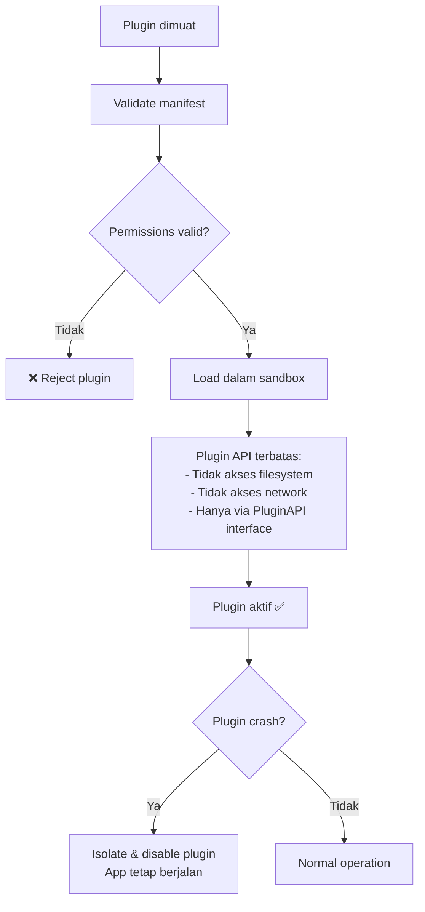

# 07 — Keamanan & Privasi

## 7.1 Prinsip Keamanan



## 7.2 Threat Model

| Ancaman | Risiko | Mitigasi |
|---------|--------|----------|
| Clipboard sniffing oleh malware | Tinggi | Auto-clear timer, sensitive detection |
| Data sensitif terekspose saat paste | Tinggi | PII masker otomatis, notifikasi |
| Relay server breach | Sedang | E2E encryption, zero-knowledge |
| Man-in-the-middle saat sync | Sedang | TLS + E2E encryption (double layer) |
| Plugin berbahaya | Sedang | Sandboxed API, permission system |
| AI API key bocor | Rendah | Encrypted storage via OS keychain |
| Clipboard history data theft | Rendah | SQLite encryption opsional, FDE reliance |

## 7.3 PII Detection — Pattern Database

```typescript
// src/security/sensitive-detector.ts

const PII_PATTERNS: Record<string, RegExp> = {
  // Email
  email: /[a-zA-Z0-9._%+-]+@[a-zA-Z0-9.-]+\.[a-zA-Z]{2,}/g,

  // No HP Indonesia (berbagai format)
  phone_id: /(?:\+62|62|0)[\s.-]?8[1-9][\d\s.-]{7,12}/g,

  // No HP International
  phone_intl: /\+\d{1,3}[\s.-]?\d{3,4}[\s.-]?\d{3,4}[\s.-]?\d{0,4}/g,

  // NIK (16 digit)
  nik: /\b\d{2}(?:0[1-9]|[1-7]\d)\d{2}(?:0[1-9]|[12]\d|3[01])(?:0[1-9]|1[012])\d{6}\b/g,

  // Kartu kredit (Luhn-compatible)
  credit_card: /\b(?:4\d{3}|5[1-5]\d{2}|6011|3[47]\d{2})[\s-]?\d{4}[\s-]?\d{4}[\s-]?\d{4}\b/g,

  // NPWP (15 digit dengan format)
  npwp: /\b\d{2}\.?\d{3}\.?\d{3}\.?\d-?\d{3}\.?\d{3}\b/g,

  // No Paspor Indonesia
  passport_id: /\b[A-Z]\d{7}\b/g,

  // No Rekening (8-16 digit)
  bank_account: /\b\d{8,16}\b/g,  // Broad, low confidence

  // IP Address
  ip_address: /\b(?:\d{1,3}\.){3}\d{1,3}\b/g,

  // AWS Keys
  aws_key: /(?:AKIA|ASIA)[A-Z0-9]{16}/g,
};
```

## 7.4 Data Masking Flow



## 7.5 E2E Encryption — Cross-Device Sync



```typescript
// src/sync/encryption.ts
import { createCipheriv, createDecipheriv, randomBytes, createECDH } from 'crypto';

const ALGORITHM = 'aes-256-gcm';
const NONCE_LENGTH = 12;
const TAG_LENGTH = 16;

function encrypt(plaintext: string, key: Buffer): EncryptedPayload {
  const nonce = randomBytes(NONCE_LENGTH);
  const cipher = createCipheriv(ALGORITHM, key, nonce);
  
  const encrypted = Buffer.concat([
    cipher.update(plaintext, 'utf8'),
    cipher.final(),
  ]);
  const tag = cipher.getAuthTag();

  return {
    ciphertext: Buffer.concat([encrypted, tag]).toString('base64'),
    nonce: nonce.toString('base64'),
  };
}

function decrypt(payload: EncryptedPayload, key: Buffer): string {
  const nonce = Buffer.from(payload.nonce, 'base64');
  const data = Buffer.from(payload.ciphertext, 'base64');
  
  const tag = data.subarray(data.length - TAG_LENGTH);
  const encrypted = data.subarray(0, data.length - TAG_LENGTH);
  
  const decipher = createDecipheriv(ALGORITHM, key, nonce);
  decipher.setAuthTag(tag);
  
  return decipher.update(encrypted) + decipher.final('utf8');
}
```

## 7.6 Plugin Sandboxing



## 7.7 Security Checklist per Fase

| Fase | Item | Status |
|------|------|--------|
| 1 | PII detection (email, HP, NIK, CC) | Belum |
| 1 | Data masking (full/partial) | Belum |
| 1 | Auto-clear clipboard timer | Belum |
| 2 | Input validation untuk regex rules | Belum |
| 2 | Sanitize HTML sebelum render preview | Belum |
| 3 | Rate limiting untuk freemium | Belum |
| 3 | License key validation | Belum |
| 4 | AI API key encrypted storage | Belum |
| 4 | OCR temp file cleanup | Belum |
| 5 | ECDH key exchange | Belum |
| 5 | AES-256-GCM encryption | Belum |
| 5 | Plugin permission system | Belum |
| 5 | Plugin sandboxing | Belum |

---

> **Dokumen selanjutnya:** [08 — Build, Deploy & Distribusi](08-deployment.md)
