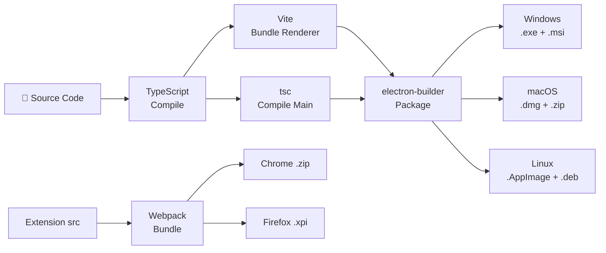
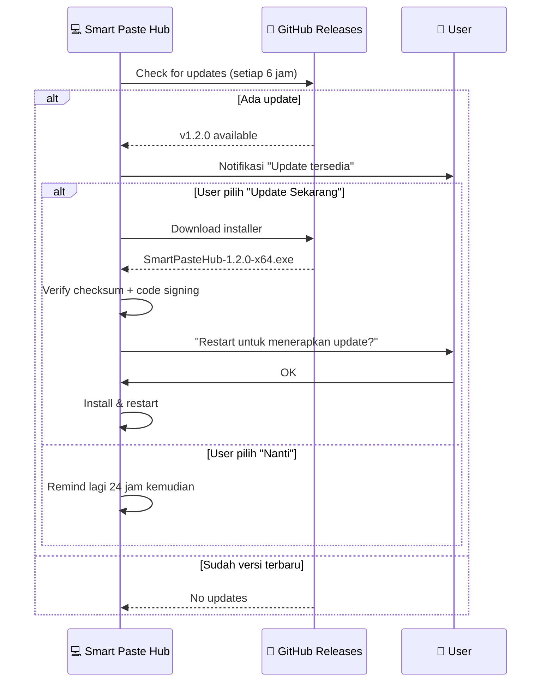
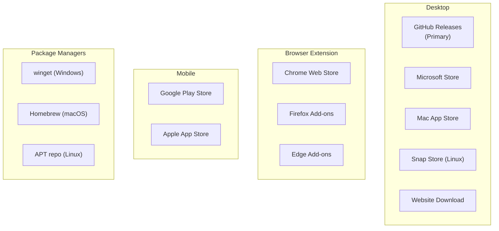
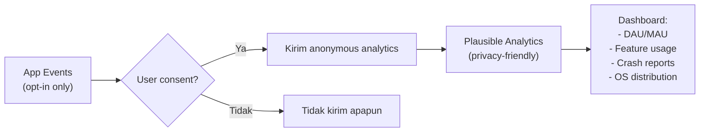

# 08 — Build, Deploy & Distribusi

## 8.1 Build Pipeline



## 8.2 CI/CD — GitHub Actions

```yaml
# .github/workflows/release.yml
name: Build & Release

on:
  push:
    tags: ['v*']

jobs:
  build-desktop:
    strategy:
      matrix:
        os: [windows-latest, macos-latest, ubuntu-latest]
    runs-on: ${{ matrix.os }}
    steps:
      - uses: actions/checkout@v4
      - uses: actions/setup-node@v4
        with: { node-version: 20 }
      - run: npm ci
      - run: npm test
      - run: npm run build
      - run: npx electron-builder --publish always
        env:
          GH_TOKEN: ${{ secrets.GITHUB_TOKEN }}
          # Code signing
          CSC_LINK: ${{ secrets.CSC_LINK }}
          CSC_KEY_PASSWORD: ${{ secrets.CSC_KEY_PASSWORD }}
          APPLE_ID: ${{ secrets.APPLE_ID }}
          APPLE_APP_SPECIFIC_PASSWORD: ${{ secrets.APPLE_APP }}

  build-extension:
    runs-on: ubuntu-latest
    steps:
      - uses: actions/checkout@v4
      - run: npm ci
      - run: npm run build:extension
      - uses: nicolo-ribaudo/chores-upload-chrome@v1
        with:
          extension-id: ${{ secrets.CHROME_EXT_ID }}
          client-id: ${{ secrets.CHROME_CLIENT_ID }}
          refresh-token: ${{ secrets.CHROME_REFRESH_TOKEN }}
          zip-path: dist/extension.zip
```

## 8.3 electron-builder Config

```yaml
# electron-builder.yml
appId: com.smartpastehub.app
productName: Smart Paste Hub
copyright: Copyright © 2026 Smart Paste Hub

directories:
  output: release
  buildResources: assets

files:
  - dist/**/*
  - package.json

win:
  target:
    - target: nsis
      arch: [x64, arm64]
    - target: portable
  icon: assets/icons/icon.ico
  artifactName: SmartPasteHub-${version}-${arch}.${ext}

nsis:
  oneClick: false
  perMachine: false
  allowToChangeInstallationDirectory: true
  installerIcon: assets/icons/icon.ico
  uninstallerIcon: assets/icons/icon.ico

mac:
  target:
    - target: dmg
      arch: [x64, arm64]
    - target: zip
  icon: assets/icons/icon.icns
  category: public.app-category.utilities
  hardenedRuntime: true
  entitlements: build/entitlements.mac.plist
  notarize: true

linux:
  target:
    - AppImage
    - deb
    - rpm
  icon: assets/icons
  category: Utility
  desktop:
    StartupWMClass: SmartPasteHub

publish:
  provider: github
  owner: smartpastehub
  repo: smartpastehub

# Auto-update
autoUpdate:
  enabled: true
  channel: latest
```

## 8.4 Auto-Update Flow



## 8.5 Distribution Channels



### Prioritas Distribusi per Fase

| Channel | Fase | Prioritas | Biaya |
|---------|------|-----------|-------|
| GitHub Releases | 1 | ⭐⭐⭐ | Gratis |
| Website Download | 1 | ⭐⭐⭐ | Domain + hosting |
| Chrome Web Store | 2 | ⭐⭐⭐ | $5 sekali |
| Firefox Add-ons | 3 | ⭐⭐ | Gratis |
| winget | 3 | ⭐⭐ | Gratis |
| Homebrew | 3 | ⭐⭐ | Gratis |
| Microsoft Store | 3 | ⭐ | $19/tahun |
| Mac App Store | 3 | ⭐ | $99/tahun |
| Google Play | 5 | ⭐ | $25 sekali |
| Apple App Store | 5 | ⭐ | $99/tahun |

## 8.6 Versioning Strategy

```
Format: MAJOR.MINOR.PATCH

v1.0.0 — Fase 1 Release (Core MVP)
v1.1.0 — Fase 2 Release (+Tables, Converters)
v1.2.0 — Fase 3 Release (+History, Templates)
v2.0.0 — Fase 4 Release (+AI, OCR) ← Major karena fitur signifikan
v3.0.0 — Fase 5 Release (+Sync, Plugins) ← Major karena infrastruktur baru
```

## 8.7 Environment & Scripts

```json
// package.json (scripts)
{
  "scripts": {
    "dev": "concurrently \"npm run dev:main\" \"npm run dev:renderer\"",
    "dev:main": "tsc -w -p tsconfig.main.json",
    "dev:renderer": "vite dev",
    "build": "npm run build:main && npm run build:renderer",
    "build:main": "tsc -p tsconfig.main.json",
    "build:renderer": "vite build",
    "build:extension": "webpack --config extension/webpack.config.js",
    "test": "vitest run",
    "test:watch": "vitest watch",
    "test:coverage": "vitest run --coverage",
    "lint": "eslint src/ --ext .ts,.tsx",
    "format": "prettier --write src/",
    "package": "electron-builder",
    "package:win": "electron-builder --win",
    "package:mac": "electron-builder --mac",
    "package:linux": "electron-builder --linux",
    "release": "electron-builder --publish always"
  }
}
```

## 8.8 Monitoring & Analytics (Opsional, Opt-in)



> [!CAUTION]
> Analytics harus 100% opt-in. Tidak boleh ada tracking tanpa consent. Default: OFF.

---

## 📖 Daftar Semua Dokumen

| # | Dokumen | Status |
|---|---------|--------|
| 00 | [Daftar Isi](00-daftar-isi.md) | ✅ |
| 01 | [Overview & Visi Produk](01-overview.md) | ✅ |
| 02 | [Arsitektur Sistem](02-architecture.md) | ✅ |
| 03 | [Backend & Core Engine](03-backend-design.md) | ✅ |
| 04 | [Frontend & UI/UX](04-frontend-design.md) | ✅ |
| 05 | [Database & Storage](05-database-storage.md) | ✅ |
| 06 | [API & Komunikasi](06-api-design.md) | ✅ |
| 07 | [Keamanan & Privasi](07-security-privacy.md) | ✅ |
| 08 | [Build, Deploy & Distribusi](08-deployment.md) | ✅ |
