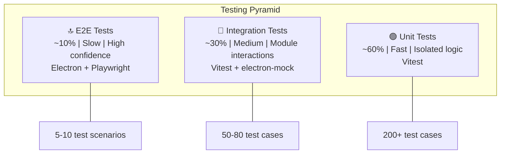
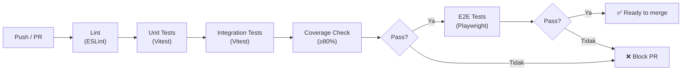

# 09 — Testing Strategy

## 9.1 Testing Pyramid



## 9.2 Coverage Target

| Module | Target | Prioritas |
|--------|--------|-----------|
| `core/` (cleaning engine) | **≥ 95%** | ⭐⭐⭐ Kritis |
| `security/` | **≥ 95%** | ⭐⭐⭐ Kritis |
| `converter/` | **≥ 90%** | ⭐⭐⭐ |
| `productivity/` | **≥ 85%** | ⭐⭐ |
| `sync/encryption.ts` | **≥ 95%** | ⭐⭐⭐ Kritis |
| `ai/` | **≥ 70%** | ⭐ (AI output unpredictable) |
| `ocr/` | **≥ 70%** | ⭐ |
| `renderer/` (React UI) | **≥ 60%** | ⭐ |
| **Total Project** | **≥ 80%** | - |

## 9.3 Unit Test — Detail per Module

### Core Engine Tests

```typescript
// tests/core/html-stripper.test.ts
describe('HTML Stripper', () => {
  describe('Plain Text Preset', () => {
    it('strips all inline styles', () => {});
    it('strips font tags with color/size', () => {});
    it('removes CSS classes', () => {});
    it('preserves line breaks from <p> and <br>', () => {});
    it('converts HTML entities to characters', () => {});
    it('handles nested formatting tags', () => {});
    it('handles empty/malformed HTML gracefully', () => {});
  });

  describe('Keep Structure Preset', () => {
    it('preserves <b>/<strong> as **text**', () => {});
    it('preserves <i>/<em> as *text*', () => {});
    it('preserves <ul>/<ol> as list items', () => {});
    it('preserves <a href> as [text](url)', () => {});
    it('strips everything else', () => {});
  });
});

// tests/core/line-break-fixer.test.ts
describe('PDF Line-Break Fixer', () => {
  it('merges lines that end without punctuation', () => {});
  it('preserves lines ending with . ! ?', () => {});
  it('preserves list items (-, *, 1.)', () => {});
  it('preserves headings (short line + capital next)', () => {});
  it('handles mixed languages (ID + EN)', () => {});
  it('handles double spacing between paragraphs', () => {});
  it('preserves code blocks / indented text', () => {});
  it('handles edge case: single word per line', () => {});
});

// tests/core/table-detector.test.ts
describe('Table Detector', () => {
  it('detects HTML <table> elements', () => {});
  it('detects TSV data (tab-separated)', () => {});
  it('detects CSV data with headers', () => {});
  it('rejects plain text that looks like CSV', () => {});
  it('handles tables with merged cells', () => {});
  it('handles empty cells', () => {});
});
```

### Security Tests

```typescript
// tests/security/sensitive-detector.test.ts
describe('Sensitive Data Detector', () => {
  it('detects email addresses', () => {
    // user@example.com, user.name+tag@sub.domain.com
  });
  it('detects Indonesian phone numbers', () => {
    // 081234567890, +62 812-3456-7890, 0812 3456 7890
  });
  it('detects NIK (16 digits with valid structure)', () => {});
  it('detects credit card numbers (Luhn-valid)', () => {});
  it('does NOT false-positive on regular numbers', () => {});
  it('detects multiple PII types in one text', () => {});
  it('returns correct start/end indices', () => {});
});

// tests/security/data-masker.test.ts
describe('Data Masker', () => {
  it('full mask: email → ****@****.***', () => {});
  it('partial mask: email → j***@gm***.com', () => {});
  it('full mask: phone → ****-****-****', () => {});
  it('partial mask: phone → 081*-****-*890', () => {});
  it('preserves non-PII text unchanged', () => {});
  it('handles overlapping matches correctly', () => {});
});
```

### Converter Tests

```typescript
// tests/converter/json-yaml-toml.test.ts
describe('JSON/YAML/TOML Converter', () => {
  it('converts JSON → YAML correctly', () => {});
  it('converts YAML → JSON correctly', () => {});
  it('converts JSON → TOML correctly', () => {});
  it('preserves nested objects', () => {});
  it('preserves arrays', () => {});
  it('handles unicode strings', () => {});
  it('throws on invalid input', () => {});
  it('auto-detects format correctly', () => {});
});
```

## 9.4 Integration Tests

```typescript
// tests/integration/cleaning-pipeline.test.ts
describe('Full Cleaning Pipeline', () => {
  it('HTML input → detect → strip → security scan → output', () => {});
  it('PDF text → detect → fix breaks → normalize → output', () => {});
  it('Table HTML → detect → convert to Markdown → output', () => {});
  it('JSON input → detect → convert to YAML → output', () => {});
  it('Text with PII → detect → alert → mask → output', () => {});
  it('applies context rules based on source app', () => {});
  it('saves to history after cleaning', () => {});
  it('respects freemium character limits', () => {});
});

// tests/integration/multi-clipboard.test.ts
describe('Multi-Clipboard Flow', () => {
  it('collects 3 items then merges with newline', () => {});
  it('paste queue serves items FIFO', () => {});
  it('queue shows correct remaining count', () => {});
  it('clears queue on manual stop', () => {});
});
```

## 9.5 E2E Tests (Playwright + Electron)

```typescript
// tests/e2e/paste-clean.spec.ts
describe('E2E: Paste Clean', () => {
  it('copies styled HTML, pastes clean via Ctrl+Alt+V', () => {
    // 1. Simulate clipboard write with HTML
    // 2. Trigger hotkey
    // 3. Verify clipboard now has clean text
  });

  it('shows toast notification after cleaning', () => {
    // Verify toast appears and auto-dismisses
  });

  it('sensitive data alert appears for PII', () => {
    // 1. Copy text containing email
    // 2. Verify alert notification
    // 3. Click mask, verify masked text
  });
});

// tests/e2e/settings.spec.ts
describe('E2E: Settings', () => {
  it('changes active preset', () => {});
  it('configures custom hotkey', () => {});
  it('toggles security features', () => {});
  it('settings persist after restart', () => {});
});
```

## 9.6 Test Fixtures

```
tests/fixtures/
├── html/
│   ├── google-docs-styled.html      # Real Google Docs export
│   ├── outlook-email.html           # Outlook email HTML
│   ├── wordpress-post.html          # WordPress rich editor
│   └── table-complex.html           # Multi-row/colspan table
├── pdf/
│   ├── academic-paper.txt           # PDF jurnal akademik
│   ├── government-doc.txt           # Dokumen pemerintah
│   ├── ebook-paragraph.txt          # Paragraf ebook
│   └── invoice.txt                  # Invoice PDF
├── data/
│   ├── sample.json                  # Valid JSON
│   ├── sample.yaml                  # Valid YAML
│   ├── sample.toml                  # Valid TOML
│   ├── spreadsheet.tsv              # Excel tab-separated
│   └── data.csv                     # CSV with headers
├── code/
│   ├── sample.py                    # Python code
│   ├── sample.ts                    # TypeScript code
│   └── sample.sql                   # SQL code
├── security/
│   ├── pii-mixed.txt                # Text with mixed PII
│   ├── false-positives.txt          # Text that looks like PII but isn't
│   └── edge-cases.txt               # Boundary cases
└── ocr/
    ├── clear-text.png               # Clear printed text
    ├── handwritten.png              # Handwritten text
    └── mixed-lang.png               # Indonesian + English
```

## 9.7 CI Test Pipeline



```yaml
# .github/workflows/test.yml
name: Test
on: [push, pull_request]
jobs:
  test:
    runs-on: ${{ matrix.os }}
    strategy:
      matrix:
        os: [ubuntu-latest, windows-latest, macos-latest]
    steps:
      - uses: actions/checkout@v4
      - uses: actions/setup-node@v4
        with: { node-version: 20 }
      - run: npm ci
      - run: npm run lint
      - run: npm run test:coverage
      - run: npm run test:e2e
        if: matrix.os == 'ubuntu-latest'
      - uses: codecov/codecov-action@v4
        with: { files: coverage/lcov.info }
```

## 9.8 Testing Tools

| Tool | Kegunaan |
|------|----------|
| **Vitest** | Unit & integration tests (fast, Vite-compatible) |
| **Playwright** | E2E tests untuk Electron app |
| **@testing-library/react** | React component testing |
| **MSW (Mock Service Worker)** | Mock HTTP/WebSocket untuk sync tests |
| **Codecov** | Coverage tracking & reporting |
| **electron-mock-ipc** | Mock Electron IPC untuk tests |

---

> **Dokumen selanjutnya:** [10 — Error Handling & Logging](10-error-handling.md)
