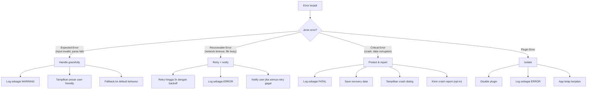
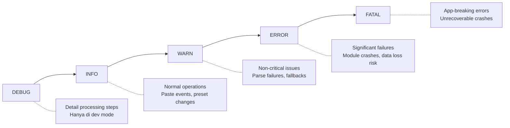
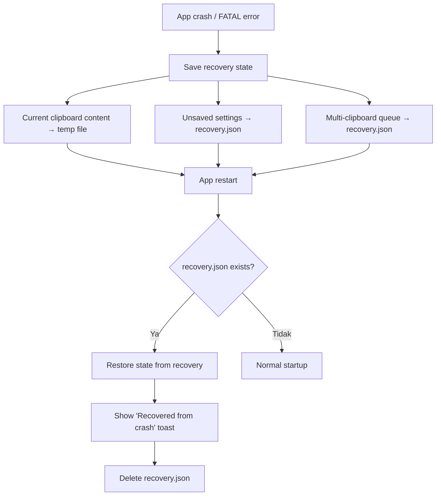

# 10 — Error Handling & Logging

## 10.1 Error Handling Strategy



## 10.2 Error Classes

```typescript
// src/shared/errors.ts

// Base error
class SmartPasteError extends Error {
  code: string;
  recoverable: boolean;
  
  constructor(message: string, code: string, recoverable = true) {
    super(message);
    this.name = 'SmartPasteError';
    this.code = code;
    this.recoverable = recoverable;
  }
}

// Specific errors
class CleaningError extends SmartPasteError {
  constructor(message: string, public inputType: string) {
    super(message, 'CLEANING_FAILED', true);
  }
}

class DetectionError extends SmartPasteError {
  constructor(message: string) {
    super(message, 'DETECTION_FAILED', true);
  }
}

class SecurityScanError extends SmartPasteError {
  constructor(message: string) {
    super(message, 'SECURITY_SCAN_FAILED', true);
  }
}

class OCRError extends SmartPasteError {
  constructor(message: string, public imagePath?: string) {
    super(message, 'OCR_FAILED', true);
  }
}

class SyncError extends SmartPasteError {
  constructor(message: string, public deviceId?: string) {
    super(message, 'SYNC_FAILED', true);
  }
}

class EncryptionError extends SmartPasteError {
  constructor(message: string) {
    super(message, 'ENCRYPTION_FAILED', false); // Non-recoverable
  }
}

class PluginError extends SmartPasteError {
  constructor(message: string, public pluginName: string) {
    super(message, 'PLUGIN_FAILED', true);
  }
}

class StorageError extends SmartPasteError {
  constructor(message: string, public operation: string) {
    super(message, 'STORAGE_FAILED', true);
  }
}
```

## 10.3 Error Handling per Layer

### Main Process

```typescript
// src/main/index.ts

// Global unhandled error handler
process.on('uncaughtException', (error) => {
  logger.fatal('Uncaught exception', { error });
  saveRecoveryState();
  showCrashDialog(error);
});

process.on('unhandledRejection', (reason) => {
  logger.error('Unhandled rejection', { reason });
});
```

### Cleaning Pipeline

```typescript
// src/core/cleaner.ts

async function cleanContent(content: ClipboardContent): Promise<CleanResult> {
  try {
    const type = detectContentType(content.text, content.html);
    
    let cleaned: string;
    try {
      cleaned = applyPreset(content, type);
    } catch (e) {
      logger.warn('Cleaning failed, using raw text', { error: e, type });
      cleaned = content.text; // Fallback: return raw text
    }

    try {
      const securityResult = await scanSecurity(cleaned);
      if (securityResult.hasPII) {
        return { cleaned, securityAlert: securityResult };
      }
    } catch (e) {
      logger.warn('Security scan failed, skipping', { error: e });
      // Non-blocking: security scan failure shouldn't block paste
    }

    return { cleaned, securityAlert: null };
  } catch (e) {
    logger.error('Complete cleaning pipeline failed', { error: e });
    return { cleaned: content.text, error: e }; // Ultimate fallback
  }
}
```

### Plugin Isolation

```typescript
// src/plugins/plugin-loader.ts

function executePlugin(plugin: SmartPastePlugin, api: PluginAPI): void {
  try {
    plugin.onActivate(api);
  } catch (error) {
    logger.error('Plugin activation failed', { 
      plugin: plugin.name, error 
    });
    disablePlugin(plugin.name);
    notifyUser(`Plugin "${plugin.name}" dinonaktifkan karena error`);
  }
}
```

## 10.4 Logging System

### Log Levels



### Logger Implementation

```typescript
// src/shared/logger.ts

import { app } from 'electron';
import path from 'path';
import fs from 'fs';

type LogLevel = 'debug' | 'info' | 'warn' | 'error' | 'fatal';

interface LogEntry {
  timestamp: string;
  level: LogLevel;
  message: string;
  context?: Record<string, unknown>;
  source?: string;
}

class Logger {
  private logDir: string;
  private currentFile: string;
  private maxFileSize = 5 * 1024 * 1024; // 5MB
  private maxFiles = 5;

  constructor() {
    this.logDir = path.join(app.getPath('userData'), 'logs');
    fs.mkdirSync(this.logDir, { recursive: true });
    this.currentFile = this.getLogFileName();
  }

  debug(msg: string, ctx?: Record<string, unknown>) { this.write('debug', msg, ctx); }
  info(msg: string, ctx?: Record<string, unknown>)  { this.write('info', msg, ctx); }
  warn(msg: string, ctx?: Record<string, unknown>)  { this.write('warn', msg, ctx); }
  error(msg: string, ctx?: Record<string, unknown>) { this.write('error', msg, ctx); }
  fatal(msg: string, ctx?: Record<string, unknown>) { this.write('fatal', msg, ctx); }

  private write(level: LogLevel, message: string, context?: Record<string, unknown>) {
    const entry: LogEntry = {
      timestamp: new Date().toISOString(),
      level,
      message,
      context: this.sanitizeContext(context),
    };
    // Write to file + console (dev only)
    const line = JSON.stringify(entry) + '\n';
    fs.appendFileSync(this.currentFile, line);
    if (process.env.NODE_ENV === 'development') {
      console.log(`[${level.toUpperCase()}] ${message}`, context || '');
    }
    this.rotateIfNeeded();
  }

  // PENTING: Jangan log data sensitif!
  private sanitizeContext(ctx?: Record<string, unknown>) {
    if (!ctx) return undefined;
    const sanitized = { ...ctx };
    const sensitiveKeys = ['password', 'apiKey', 'token', 'secret', 'key'];
    for (const k of Object.keys(sanitized)) {
      if (sensitiveKeys.some(sk => k.toLowerCase().includes(sk))) {
        sanitized[k] = '[REDACTED]';
      }
    }
    return sanitized;
  }

  private getLogFileName(): string {
    const date = new Date().toISOString().split('T')[0];
    return path.join(this.logDir, `smartpaste-${date}.log`);
  }

  private rotateIfNeeded() { /* Rotate when > maxFileSize, keep maxFiles */ }
}

export const logger = new Logger();
```

### Log File Location

| Platform | Path |
|----------|------|
| Windows | `%APPDATA%/SmartPasteHub/logs/` |
| macOS | `~/Library/Application Support/SmartPasteHub/logs/` |
| Linux | `~/.config/SmartPasteHub/logs/` |

### Log Format

```jsonl
{"timestamp":"2026-02-16T20:30:00.123Z","level":"info","message":"Clipboard cleaned","context":{"type":"styled_html","charCount":256,"preset":"keepStructure"}}
{"timestamp":"2026-02-16T20:30:01.456Z","level":"warn","message":"PII detected","context":{"types":["email","phone"],"count":3}}
{"timestamp":"2026-02-16T20:30:05.789Z","level":"error","message":"OCR failed","context":{"error":"Tesseract timeout","imageSize":"2.1MB"}}
```

## 10.5 User-Facing Error Messages

| Error Code | Pesan Internal | Pesan User (ID) |
|------------|---------------|-----------------|
| `CLEANING_FAILED` | Cleaning pipeline error | "Gagal membersihkan teks. Teks asli akan digunakan." |
| `DETECTION_FAILED` | Content type unknown | "Jenis konten tidak dikenali. Menggunakan preset default." |
| `OCR_FAILED` | Tesseract error | "OCR gagal mengenali teks. Coba area yang lebih jelas." |
| `SYNC_FAILED` | WebSocket disconnect | "Koneksi sync terputus. Mencoba ulang..." |
| `ENCRYPTION_FAILED` | Key derivation error | "Enkripsi gagal. Hubungi support." |
| `PLUGIN_FAILED` | Plugin crash | "Plugin '{name}' error dan dinonaktifkan." |
| `STORAGE_FAILED` | SQLite error | "Gagal menyimpan data. Periksa ruang disk." |
| `HOTKEY_CONFLICT` | Shortcut taken | "Hotkey sudah digunakan aplikasi lain. Pilih hotkey baru." |

## 10.6 Crash Recovery



---

> **Dokumen selanjutnya:** [11 — Performance & Optimization](11-performance.md)
