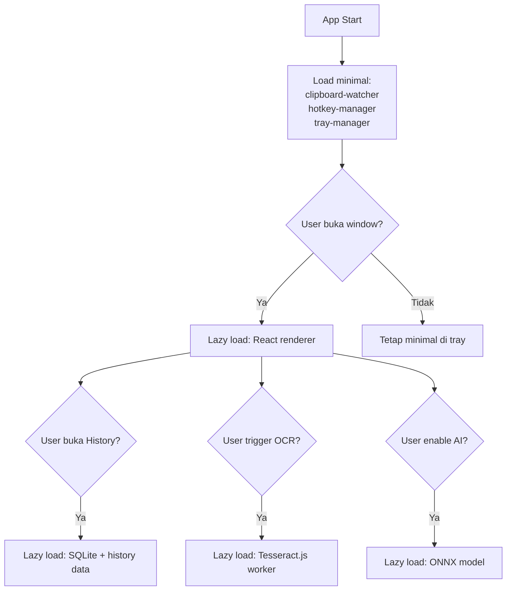
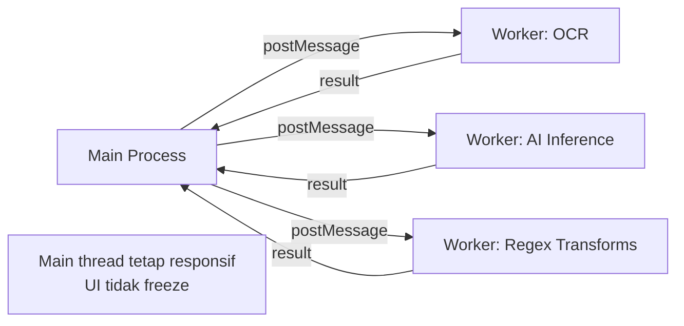

# 11 — Performance & Optimization

## 11.1 Performance Budget

| Operasi | Target | Max Acceptable | Metrik |
|---------|--------|----------------|--------|
| Clipboard detection | **< 5ms** | 15ms | time-to-detect |
| HTML stripping (< 5KB) | **< 10ms** | 30ms | time-to-clean |
| PDF line-break fix | **< 15ms** | 50ms | time-to-clean |
| Table conversion | **< 20ms** | 80ms | time-to-convert |
| Full cleaning pipeline | **< 50ms** | 100ms | hotkey-to-clipboard |
| Security scan (PII) | **< 10ms** | 30ms | time-to-scan |
| OCR (region screenshot) | **< 3s** | 5s | time-to-text |
| AI rewrite (local) | **< 2s** | 5s | time-to-response |
| App cold start | **< 2s** | 4s | launch-to-ready |
| Settings window open | **< 200ms** | 500ms | click-to-render |
| History search (1000 items) | **< 50ms** | 200ms | type-to-results |
| Sync latency (E2E) | **< 500ms** | 1.5s | copy-to-receive |

## 11.2 Memory Budget

| Komponen | Budget | Catatan |
|----------|--------|---------|
| Main process (idle) | **< 50 MB** | Clipboard watcher + tray |
| Renderer process | **< 80 MB** | React UI (saat terbuka) |
| OCR model (loaded) | **< 40 MB** | Tesseract worker |
| AI model (local) | **< 200 MB** | ONNX model in memory |
| **Total (idle)** | **< 60 MB** | Tanpa window terbuka |
| **Total (active)** | **< 180 MB** | Window + 1 model loaded |

## 11.3 Optimization Strategies

### Lazy Loading



```typescript
// Lazy loading modules
const modules = {
  ocr: () => import('./ocr/ocr-engine'),
  ai: () => import('./ai/format-detector'),
  sync: () => import('./sync/sync-manager'),
  converter: () => import('./converter/json-yaml-toml'),
};

async function loadModule(name: keyof typeof modules) {
  const start = performance.now();
  const mod = await modules[name]();
  logger.debug(`Module ${name} loaded`, { 
    duration: performance.now() - start 
  });
  return mod;
}
```

### Debouncing & Throttling

```typescript
// Clipboard watcher: debounce rapid changes
const debouncedClipboardHandler = debounce(
  handleClipboardChange, 
  150  // 150ms — cegah spam dari clipboard managers
);

// History search: debounce keystroke
const debouncedSearch = debounce(
  searchHistory, 
  300  // 300ms — tunggu user selesai mengetik
);

// Sync: throttle outgoing messages
const throttledSync = throttle(
  sendSyncMessage, 
  1000  // Max 1 sync/detik
);
```

### Web Worker untuk Operasi Berat



### SQLite Optimization

```sql
-- Index strategis untuk query yang sering
CREATE INDEX idx_history_search ON clipboard_history(created_at DESC, content_type);

-- Prepared statements untuk query berulang
-- (di-cache di app level, bukan create setiap call)

-- WAL mode untuk concurrent read/write
PRAGMA journal_mode = WAL;
PRAGMA synchronous = NORMAL;

-- Memory-mapped I/O untuk read kecepatan tinggi
PRAGMA mmap_size = 268435456; -- 256MB

-- Cache size yang memadai
PRAGMA cache_size = -8000; -- 8MB cache
```

## 11.4 Benchmarking

```typescript
// src/shared/benchmark.ts

function benchmark(name: string, fn: () => void, iterations = 1000): BenchmarkResult {
  const times: number[] = [];
  
  for (let i = 0; i < iterations; i++) {
    const start = performance.now();
    fn();
    times.push(performance.now() - start);
  }

  return {
    name,
    iterations,
    avg: mean(times),
    p50: percentile(times, 50),
    p95: percentile(times, 95),
    p99: percentile(times, 99),
    min: Math.min(...times),
    max: Math.max(...times),
  };
}

// Benchmark report
// ┌──────────────────────┬──────┬──────┬──────┬──────┐
// │ Operation            │  Avg │  P50 │  P95 │  P99 │
// ├──────────────────────┼──────┼──────┼──────┼──────┤
// │ Content Detection    │  2ms │  1ms │  4ms │  8ms │
// │ HTML Strip (2KB)     │  5ms │  4ms │  9ms │ 15ms │
// │ PDF Line Fix (5KB)   │  8ms │  7ms │ 14ms │ 22ms │
// │ Table→Markdown       │ 12ms │ 10ms │ 20ms │ 35ms │
// │ Full Pipeline        │ 28ms │ 25ms │ 45ms │ 68ms │
// │ PII Scan             │  4ms │  3ms │  7ms │ 12ms │
// │ History Search       │ 15ms │ 12ms │ 30ms │ 55ms │
// └──────────────────────┴──────┴──────┴──────┴──────┘
```

## 11.5 Monitoring di Runtime

```typescript
// Performance monitoring (dev + opt-in prod)
const metrics = {
  cleaningDuration: new Histogram('cleaning_duration_ms'),
  detectionDuration: new Histogram('detection_duration_ms'),
  memoryUsage: new Gauge('memory_usage_mb'),
  clipboardEvents: new Counter('clipboard_events_total'),
};

// Periodic memory check
setInterval(() => {
  const usage = process.memoryUsage();
  metrics.memoryUsage.set(usage.heapUsed / 1024 / 1024);
  
  if (usage.heapUsed > 150 * 1024 * 1024) {
    logger.warn('High memory usage', { mb: usage.heapUsed / 1024 / 1024 });
    global.gc?.(); // Force GC jika tersedia
  }
}, 60_000); // Setiap 1 menit
```

---

> **Dokumen selanjutnya:** [12 — Internationalization (i18n)](12-internationalization.md)
