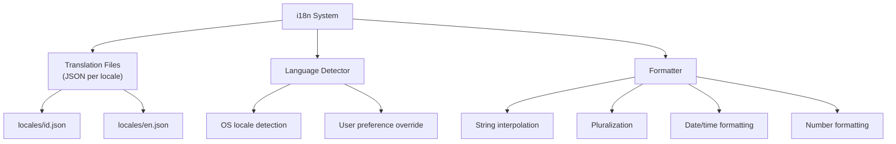
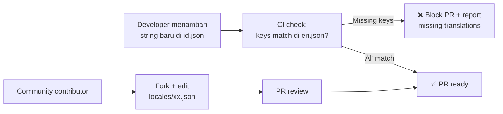

# 12 — Internationalization (i18n)

## 12.1 Bahasa yang Didukung

| Kode | Bahasa | Status | Prioritas |
|------|--------|--------|-----------|
| `id` | **Bahasa Indonesia** | Default | ⭐⭐⭐ |
| `en` | **English** | MVP | ⭐⭐⭐ |
| `ms` | Bahasa Melayu | Post-launch | ⭐ |
| `zh` | 中文 (Chinese) | Post-launch | ⭐ |

## 12.2 Arsitektur i18n



## 12.3 Translation File Structure

```jsonc
// src/locales/id.json
{
  "app": {
    "name": "Smart Paste Hub",
    "tagline": "Clipboard Formatter untuk Profesional"
  },
  "tray": {
    "preset": "Preset Aktif",
    "multiClipboard": "Multi-Clipboard",
    "pasteQueue": "Antrian Paste",
    "settings": "Pengaturan",
    "history": "Riwayat",
    "snippets": "Snippet",
    "quit": "Keluar"
  },
  "settings": {
    "title": "Pengaturan",
    "hotkeys": {
      "title": "Konfigurasi Hotkey",
      "pasteClean": "Paste Bersih",
      "ocrCapture": "Tangkap OCR",
      "multiCopy": "Multi-Copy",
      "queueToggle": "Toggle Antrian"
    },
    "presets": {
      "title": "Preset Aktif",
      "plainText": "Teks Polos (strip semua)",
      "keepStructure": "Pertahankan Struktur",
      "addNew": "Tambah Preset Baru"
    },
    "security": {
      "title": "Keamanan",
      "detectSensitive": "Deteksi data sensitif",
      "autoClear": "Auto-hapus clipboard",
      "timer": "Timer"
    }
  },
  "history": {
    "title": "Riwayat Clipboard",
    "search": "Cari riwayat...",
    "filter": {
      "all": "Semua",
      "today": "Hari ini",
      "thisWeek": "Minggu ini"
    },
    "actions": {
      "copy": "Salin",
      "pin": "Sematkan",
      "delete": "Hapus"
    },
    "showing": "Menampilkan {start}-{end} dari {total}"
  },
  "toast": {
    "cleaned": "Teks dibersihkan & siap di-paste",
    "piiDetected": "Data sensitif terdeteksi!",
    "ocrDone": "OCR: {count} karakter dikenali",
    "syncNew": "Item baru dari {device}",
    "maskAll": "Mask Semua",
    "maskPartial": "Mask Sebagian",
    "ignore": "Abaikan"
  },
  "template": {
    "title": "Template Manager",
    "create": "Buat Template Baru",
    "variables": "Variabel",
    "save": "Simpan",
    "preview": "Pratinjau"
  },
  "sync": {
    "status": "Status Koneksi",
    "connected": "Terhubung",
    "disconnected": "Terputus",
    "pairing": "Pindai QR Code",
    "device": "Perangkat"
  },
  "errors": {
    "cleaningFailed": "Gagal membersihkan teks. Teks asli akan digunakan.",
    "detectionFailed": "Jenis konten tidak dikenali. Menggunakan preset default.",
    "ocrFailed": "OCR gagal mengenali teks. Coba area yang lebih jelas.",
    "syncFailed": "Koneksi sync terputus. Mencoba ulang...",
    "storageFailed": "Gagal menyimpan data. Periksa ruang disk.",
    "pluginFailed": "Plugin \"{name}\" error dan dinonaktifkan."
  },
  "onboarding": {
    "welcome": "Selamat Datang di Smart Paste Hub!",
    "setupHotkeys": "Atur Hotkey",
    "choosePreset": "Pilih Preset Default",
    "securityOptions": "Opsi Keamanan",
    "tryDemo": "Coba Demo: Paste Clean",
    "done": "Setup Selesai!",
    "upgradeNow": "Upgrade Sekarang",
    "maybeLater": "Nanti Saja"
  },
  "pricing": {
    "free": "Gratis",
    "pro": "Pro",
    "ultimate": "Ultimate",
    "perMonth": "/bulan",
    "lifetime": "Seumur Hidup"
  }
}
```

```jsonc
// src/locales/en.json
{
  "app": {
    "name": "Smart Paste Hub",
    "tagline": "Clipboard Formatter for Professionals"
  },
  "tray": {
    "preset": "Active Preset",
    "multiClipboard": "Multi-Clipboard",
    "pasteQueue": "Paste Queue",
    "settings": "Settings",
    "history": "History",
    "snippets": "Snippets",
    "quit": "Quit"
  },
  "settings": {
    "title": "Settings",
    "hotkeys": {
      "title": "Hotkey Configuration",
      "pasteClean": "Paste Clean",
      "ocrCapture": "OCR Capture",
      "multiCopy": "Multi-Copy",
      "queueToggle": "Queue Toggle"
    },
    "presets": {
      "title": "Active Preset",
      "plainText": "Plain Text (strip all)",
      "keepStructure": "Keep Structure",
      "addNew": "Add New Preset"
    },
    "security": {
      "title": "Security",
      "detectSensitive": "Detect sensitive data",
      "autoClear": "Auto-clear clipboard",
      "timer": "Timer"
    }
  },
  "toast": {
    "cleaned": "Text cleaned & ready to paste",
    "piiDetected": "Sensitive data detected!",
    "ocrDone": "OCR: {count} characters recognized",
    "syncNew": "New item from {device}",
    "maskAll": "Mask All",
    "maskPartial": "Mask Partial",
    "ignore": "Ignore"
  },
  "errors": {
    "cleaningFailed": "Failed to clean text. Original text will be used.",
    "detectionFailed": "Content type not recognized. Using default preset.",
    "ocrFailed": "OCR failed to recognize text. Try a clearer area.",
    "syncFailed": "Sync connection lost. Retrying...",
    "storageFailed": "Failed to save data. Check disk space.",
    "pluginFailed": "Plugin \"{name}\" crashed and has been disabled."
  }
}
```

## 12.4 i18n Helper

```typescript
// src/shared/i18n.ts

import id from '../locales/id.json';
import en from '../locales/en.json';

const translations: Record<string, typeof id> = { id, en };

let currentLocale = 'id';

export function setLocale(locale: string): void {
  if (translations[locale]) {
    currentLocale = locale;
  }
}

export function t(key: string, params?: Record<string, string | number>): string {
  // key = "toast.ocrDone" → translations['id']['toast']['ocrDone']
  const keys = key.split('.');
  let value: unknown = translations[currentLocale];
  
  for (const k of keys) {
    value = (value as Record<string, unknown>)?.[k];
  }
  
  if (typeof value !== 'string') {
    console.warn(`Missing translation: ${key} [${currentLocale}]`);
    return key;
  }

  // Interpolation: "OCR: {count} karakter" → "OCR: 127 karakter"
  if (params) {
    return value.replace(/\{(\w+)\}/g, (_, k) => String(params[k] ?? `{${k}}`));
  }
  return value;
}

// Usage:
// t('toast.cleaned')                    → "Teks dibersihkan & siap di-paste"
// t('toast.ocrDone', { count: 127 })    → "OCR: 127 karakter dikenali"
// t('errors.pluginFailed', { name: 'X'}) → "Plugin "X" error dan dinonaktifkan."
```

## 12.5 Date & Number Formatting

```typescript
// src/shared/formatters.ts

export function formatDate(date: Date, locale = currentLocale): string {
  return new Intl.DateTimeFormat(locale === 'id' ? 'id-ID' : 'en-US', {
    year: 'numeric', month: 'short', day: 'numeric',
    hour: '2-digit', minute: '2-digit',
  }).format(date);
  // id: "16 Feb 2026, 20.30"
  // en: "Feb 16, 2026, 8:30 PM"
}

export function formatNumber(num: number, locale = currentLocale): string {
  return new Intl.NumberFormat(locale === 'id' ? 'id-ID' : 'en-US').format(num);
  // id: "1.234.567"
  // en: "1,234,567"
}

export function formatRelative(date: Date, locale = currentLocale): string {
  const diff = Date.now() - date.getTime();
  const minutes = Math.floor(diff / 60000);
  
  if (locale === 'id') {
    if (minutes < 1) return 'Baru saja';
    if (minutes < 60) return `${minutes} menit lalu`;
    if (minutes < 1440) return `${Math.floor(minutes / 60)} jam lalu`;
    return `${Math.floor(minutes / 1440)} hari lalu`;
  } else {
    if (minutes < 1) return 'Just now';
    if (minutes < 60) return `${minutes}m ago`;
    if (minutes < 1440) return `${Math.floor(minutes / 60)}h ago`;
    return `${Math.floor(minutes / 1440)}d ago`;
  }
}
```

## 12.6 Translation Workflow



---

> **Dokumen selanjutnya:** [13 — Accessibility (a11y)](13-accessibility.md)
