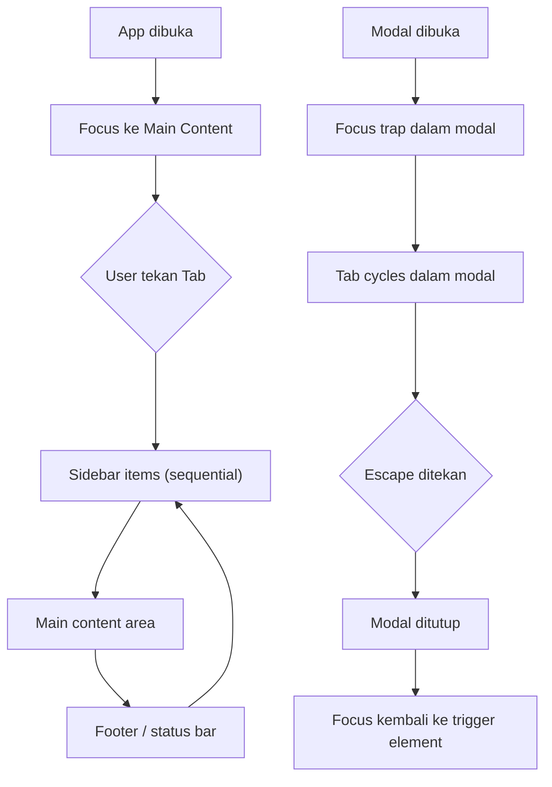

# 13 — Accessibility (a11y)

## 13.1 Target Compliance

| Standar | Level | Status |
|---------|-------|--------|
| **WCAG 2.1** | AA | Target |
| **Section 508** | - | Awareness |
| **Keyboard Navigation** | Full | Required |
| **Screen Reader** | Partial | Target |

## 13.2 Keyboard Navigation

### Global Shortcuts (Selalu Aktif)

| Shortcut | Aksi | Context |
|----------|------|---------|
| `Ctrl+Alt+V` | Paste Clean | Global (semua app) |
| `Ctrl+Alt+S` | OCR Capture | Global |
| `Ctrl+Alt+C` | Multi-Copy | Global |
| `Ctrl+Alt+Q` | Toggle Paste Queue | Global |
| `Ctrl+Alt+H` | Buka History | Global |

### In-App Navigation

| Shortcut | Aksi | Context |
|----------|------|---------|
| `Tab` / `Shift+Tab` | Navigate antar elemen | All pages |
| `Enter` / `Space` | Activate focused element | All pages |
| `Escape` | Close modal / cancel | Modals, popups |
| `↑` / `↓` | Navigate list items | History, Snippets |
| `Ctrl+F` | Focus search bar | History page |
| `Ctrl+1-7` | Switch sidebar tabs | Main window |
| `Delete` | Delete focused item | History, Snippets |

### Focus Management



## 13.3 ARIA Implementation

### Sidebar Navigation

```html
<nav aria-label="Menu utama" role="navigation">
  <ul role="menubar" aria-orientation="vertical">
    <li role="menuitem" tabindex="0" aria-current="page">
      <span aria-hidden="true">⚙️</span>
      <span>Pengaturan</span>
    </li>
    <li role="menuitem" tabindex="-1">
      <span aria-hidden="true">📚</span>
      <span>Riwayat</span>
    </li>
    <!-- ... -->
  </ul>
</nav>
```

### History List

```html
<section aria-label="Riwayat clipboard">
  <div role="search">
    <input 
      type="search" 
      aria-label="Cari riwayat" 
      placeholder="Cari riwayat..."
    />
  </div>
  
  <ul role="list" aria-label="Daftar riwayat">
    <li role="listitem" tabindex="0" aria-label="Teks dari 14:32 - Lorem ipsum dolor sit amet...">
      <time datetime="2026-02-16T14:32:00">14:32</time>
      <p>Lorem ipsum dolor sit amet...</p>
      <div role="toolbar" aria-label="Aksi item">
        <button aria-label="Salin ke clipboard">📋</button>
        <button aria-label="Sematkan item">📌</button>
        <button aria-label="Hapus item">🗑️</button>
      </div>
    </li>
  </ul>
  
  <nav aria-label="Navigasi halaman">
    <button aria-label="Halaman sebelumnya">‹ Prev</button>
    <span aria-live="polite">Menampilkan 1-20 dari 47</span>
    <button aria-label="Halaman selanjutnya">Next ›</button>
  </nav>
</section>
```

### Toast Notifications

```html
<!-- Role alert untuk notifikasi penting -->
<div role="alert" aria-live="assertive" aria-atomic="true">
  <p>⚠️ Data sensitif terdeteksi!</p>
  <p>2 email, 1 nomor HP ditemukan</p>
  <div role="toolbar">
    <button>Mask Semua</button>
    <button>Mask Partial</button>
    <button>Abaikan</button>
  </div>
</div>

<!-- Role status untuk notifikasi biasa -->
<div role="status" aria-live="polite">
  <p>✅ Teks dibersihkan & siap di-paste</p>
</div>
```

### Toggle/Switch

```html
<div role="group" aria-labelledby="security-heading">
  <h3 id="security-heading">Keamanan</h3>
  
  <label id="sensitive-label">Deteksi data sensitif</label>
  <button 
    role="switch" 
    aria-checked="true" 
    aria-labelledby="sensitive-label"
    tabindex="0"
  >
    ON
  </button>
  
  <label id="autoclear-label">Auto-clear clipboard</label>
  <button 
    role="switch" 
    aria-checked="false" 
    aria-labelledby="autoclear-label"
    tabindex="0"
  >
    OFF
  </button>
</div>
```

## 13.4 Visual Accessibility

### Color Contrast

| Elemen | Foreground | Background | Ratio | Status |
|--------|-----------|------------|-------|--------|
| Body text (light) | `#1A1A2E` | `#FFFFFF` | **15.3:1** | ✅ AAA |
| Body text (dark) | `#E0E0E0` | `#1A1A2E` | **11.2:1** | ✅ AAA |
| Secondary text (light) | `#666666` | `#FFFFFF` | **5.7:1** | ✅ AA |
| Secondary text (dark) | `#A0A0A0` | `#1A1A2E` | **6.3:1** | ✅ AA |
| Accent on bg (light) | `#6C63FF` | `#FFFFFF` | **4.6:1** | ✅ AA |
| Error text | `#FF3D00` | `#FFFFFF` | **4.5:1** | ✅ AA |

### Focus Indicators

```css
/* Focus yang jelas dan konsisten */
*:focus-visible {
  outline: 3px solid var(--accent-primary);
  outline-offset: 2px;
  border-radius: var(--radius-sm);
}

/* Untuk dark mode, outline lebih terang */
[data-theme="dark"] *:focus-visible {
  outline-color: var(--accent-primary);
  box-shadow: 0 0 0 3px rgba(124, 116, 255, 0.4);
}

/* Hapus outline untuk mouse clicks, pertahankan untuk keyboard */
*:focus:not(:focus-visible) {
  outline: none;
}
```

### Motion Preferences

```css
/* Hormati preferensi reduce-motion */
@media (prefers-reduced-motion: reduce) {
  *,
  *::before,
  *::after {
    animation-duration: 0.01ms !important;
    animation-iteration-count: 1 !important;
    transition-duration: 0.01ms !important;
  }
  
  .toast-enter {
    animation: none;
    opacity: 1;
  }
}
```

## 13.5 Screen Reader Support

### Live Regions

```typescript
// Announce actions ke screen reader
function announceToScreenReader(message: string, priority: 'polite' | 'assertive' = 'polite') {
  const el = document.getElementById('sr-announcer');
  if (el) {
    el.setAttribute('aria-live', priority);
    el.textContent = message;
    // Clear setelah dibaca
    setTimeout(() => { el.textContent = ''; }, 1000);
  }
}

// Usage:
announceToScreenReader('Teks berhasil dibersihkan, 256 karakter');
announceToScreenReader('Data sensitif terdeteksi!', 'assertive');
```

### Hidden Announcer Element

```html
<!-- Ditambahkan di root App -->
<div 
  id="sr-announcer" 
  aria-live="polite" 
  aria-atomic="true" 
  class="sr-only"
  style="position:absolute;width:1px;height:1px;overflow:hidden;clip:rect(0,0,0,0)"
></div>
```

## 13.6 Testing Checklist

| Test | Tool | Target |
|------|------|--------|
| Keyboard-only navigation | Manual testing | Semua fitur accessible via keyboard |
| Screen reader compatibility | NVDA (Win) / VoiceOver (Mac) | Core flows announced correctly |
| Color contrast | axe-core / Lighthouse | Min 4.5:1 (AA) semua teks |
| Focus order logical | Manual testing | Tab order matches visual order |
| ARIA attributes valid | axe-core | 0 ARIA violations |
| Reduced motion respected | Browser devtools | No animations when prefers-reduced-motion |

---

> **Dokumen selanjutnya:** [14 — Risk Assessment](14-risk-assessment.md)
