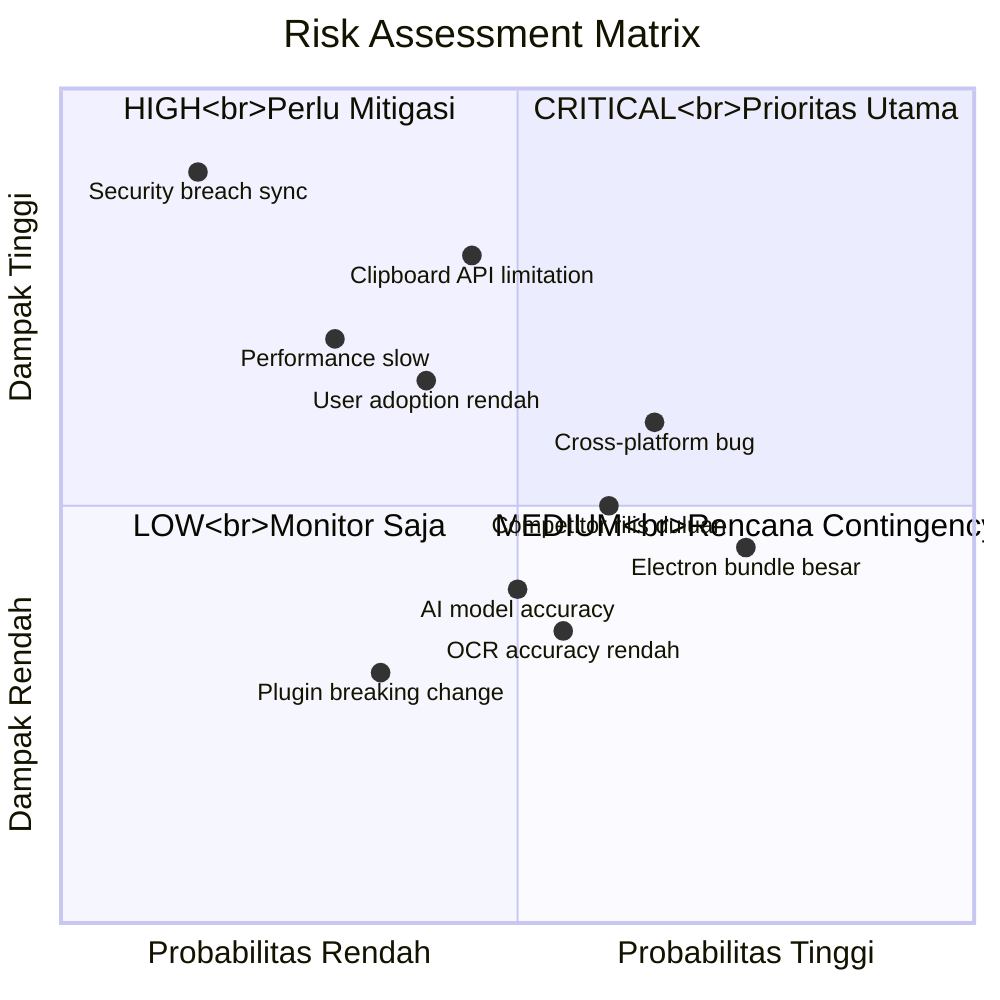
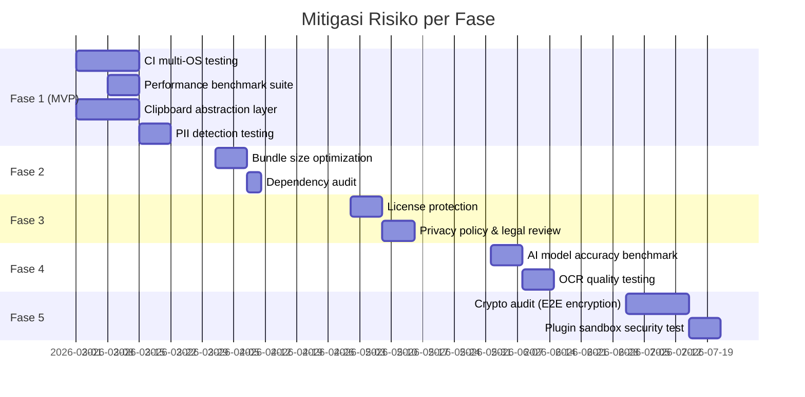
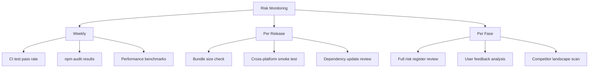

# 14 — Risk Assessment

## 14.1 Risk Matrix

## 14.2 Risk Register — Risiko Teknis

### 🔴 CRITICAL

| ID | Risiko | Probabilitas | Dampak | Mitigasi | Contingency |
|----|--------|:------------:|:------:|----------|-------------|
| T01 | **Clipboard API limitation** — OS-level clipboard access berbeda tiap platform, beberapa format tidak didukung | Sedang | Tinggi | Gunakan native addon (node-gyp) untuk akses low-level clipboard per OS | Fallback ke Electron's built-in clipboard API yang lebih terbatas |
| T02 | **Performance degradation** — Pipeline terlalu lambat (>100ms) membuat UX buruk | Rendah | Tinggi | Performance budget ketat, benchmark di CI, lazy loading | Disable fitur-fitur berat (AI/OCR) secara otomatis jika performa turun |
| T03 | **Security breach pada sync** — Enkripsi E2E bermasalah, data bocor | Sangat Rendah | Sangat Tinggi | Audit kriptografi, gunakan library proven (Node crypto), zero-knowledge relay | Kill switch: disable sync feature remotely, force re-pairing |

### 🟡 HIGH

| ID | Risiko | Probabilitas | Dampak | Mitigasi | Contingency |
|----|--------|:------------:|:------:|----------|-------------|
| T04 | **Cross-platform inconsistency** — Behavior berbeda di Windows/macOS/Linux | Tinggi | Sedang | CI testing di 3 OS, abstraction layer untuk OS-specific code | Platform-specific workarounds dengan feature flags |
| T05 | **Electron bundle size besar** — Download size >100MB membuat user malas install | Tinggi | Sedang | Tree shaking agresif, lazy load heavy modules, code splitting | Tawarkan "lite" installer tanpa AI/OCR (~30MB) |
| T06 | **Competitor rilis duluan** — Clipboard History, Paste, atau Ditto rilis fitur serupa | Sedang | Sedang | Focus pada USP: Indonesian locale, PDF fixer, context rules | Pivot ke niche market (akademik, pemerintahan Indonesia) |
| T07 | **User adoption rendah** — Free tier tidak menarik, Pro terlalu mahal | Sedang | Tinggi | A/B test pricing, generous free tier, early adopter discount | Revisi pricing model, pertimbangkan open-source core |

### 🟢 MEDIUM & LOW

| ID | Risiko | Probabilitas | Dampak | Mitigasi | Contingency |
|----|--------|:------------:|:------:|----------|-------------|
| T08 | AI model accuracy — Local model kurang akurat | Sedang | Rendah | Support cloud AI sebagai fallback, fine-tune model | Disable AI, rely on rule-based detection |
| T09 | OCR accuracy rendah — Tesseract kurang bagus untuk teks Indonesia | Sedang | Rendah | Pre-process image (contrast, denoise), support multi-language | Integrasi Google Cloud Vision sebagai premium option |
| T10 | Plugin ecosystem sepi — Tidak ada developer membuat plugin | Sedang | Rendah | Buat 5-10 official plugins sebagai contoh, documentation bagus | Fokus ke built-in features, plugin sebagai bonus |
| T11 | Dependency vulnerability — npm package ada CVE | Sedang | Sedang | Dependabot, audit periodik, minimal dependencies | Pin versions, fork & patch jika perlu |
| T12 | Electron version upgrade — Breaking changes di Electron baru | Rendah | Sedang | Update di minor version cycle, E2E test coverage | Delay upgrade, maintain LTS version |

## 14.3 Risk Register — Risiko Bisnis

| ID | Risiko | Probabilitas | Dampak | Mitigasi | Contingency |
|----|--------|:------------:|:------:|----------|-------------|
| B01 | **Revenue terlalu rendah** — Conversion free→pro < 2% | Sedang | Tinggi | Upselling via in-app prompts, free tier yang useful tapi limited | Tambah revenue stream: enterprise license, white-label |
| B02 | **Piracy / license bypass** — Keygen atau crack tersebar | Sedang | Sedang | Server-side validation, feature degradation bukan hard lock | Pindah ke subscription model yang membutuhkan online verification |
| B03 | **Legal / compliance issue** — Data privacy regulation (GDPR, UU PDP) | Rendah | Tinggi | Local-first architecture, no cloud data, privacy policy jelas | Legal review, comply atau disable sync di region tertentu |
| B04 | **Burnout developer** — Solo/small team, scope terlalu besar | Tinggi | Tinggi | Phase-based development, MVP first, community contributors | Cut scope: fokus Phase 1-3, delay Phase 4-5 |
| B05 | **App store rejection** — Clipboard access di-reject MacOS/Windows Store | Rendah | Sedang | Proper entitlements, clear privacy explanation, sandbox compliance | Distribute via website dan GitHub releases saja |

## 14.4 Risk Mitigation Timeline

## 14.5 Monitoring & Early Warning

---

> **Dokumen selanjutnya:** [17 — Contributing Guide](17-contributing.md)
