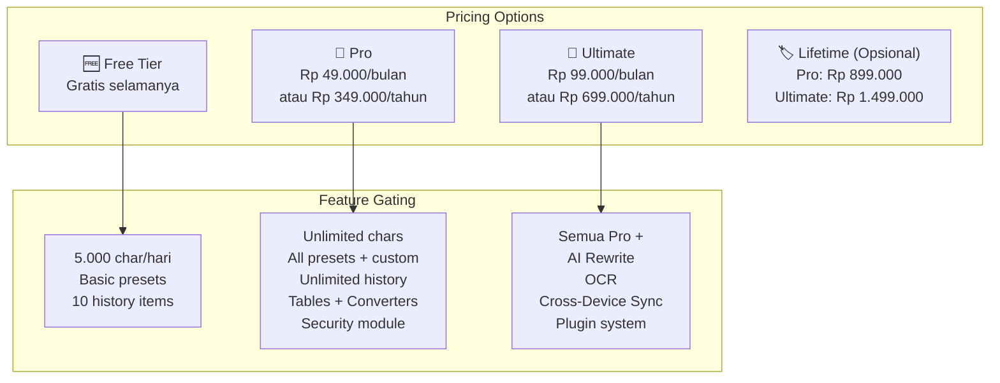
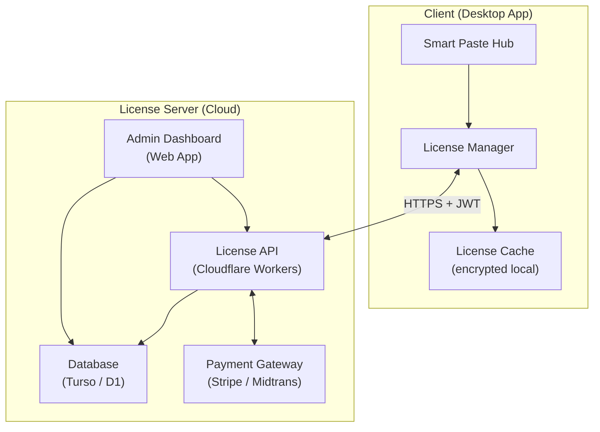
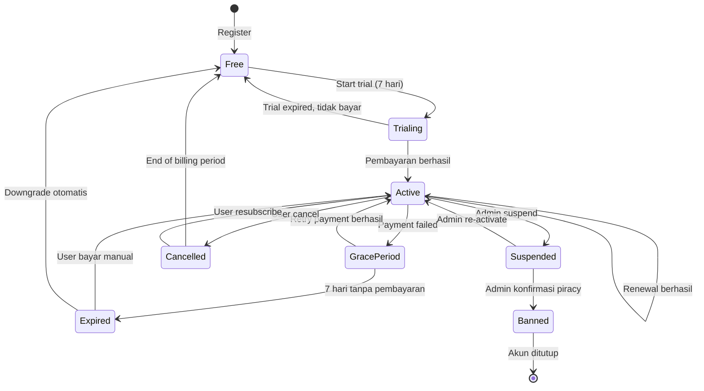
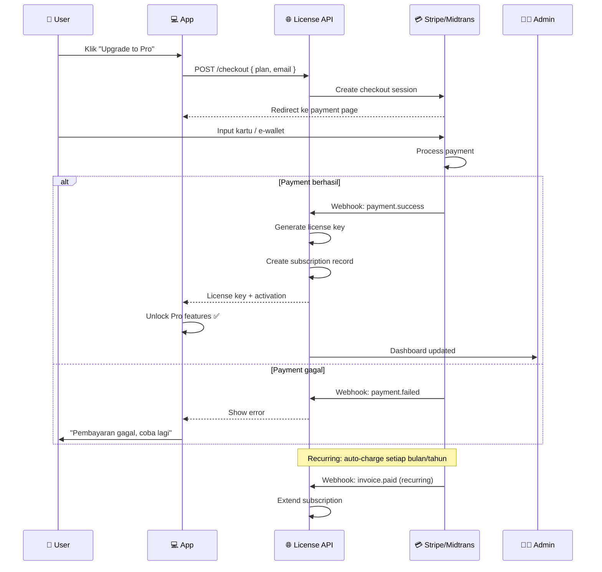
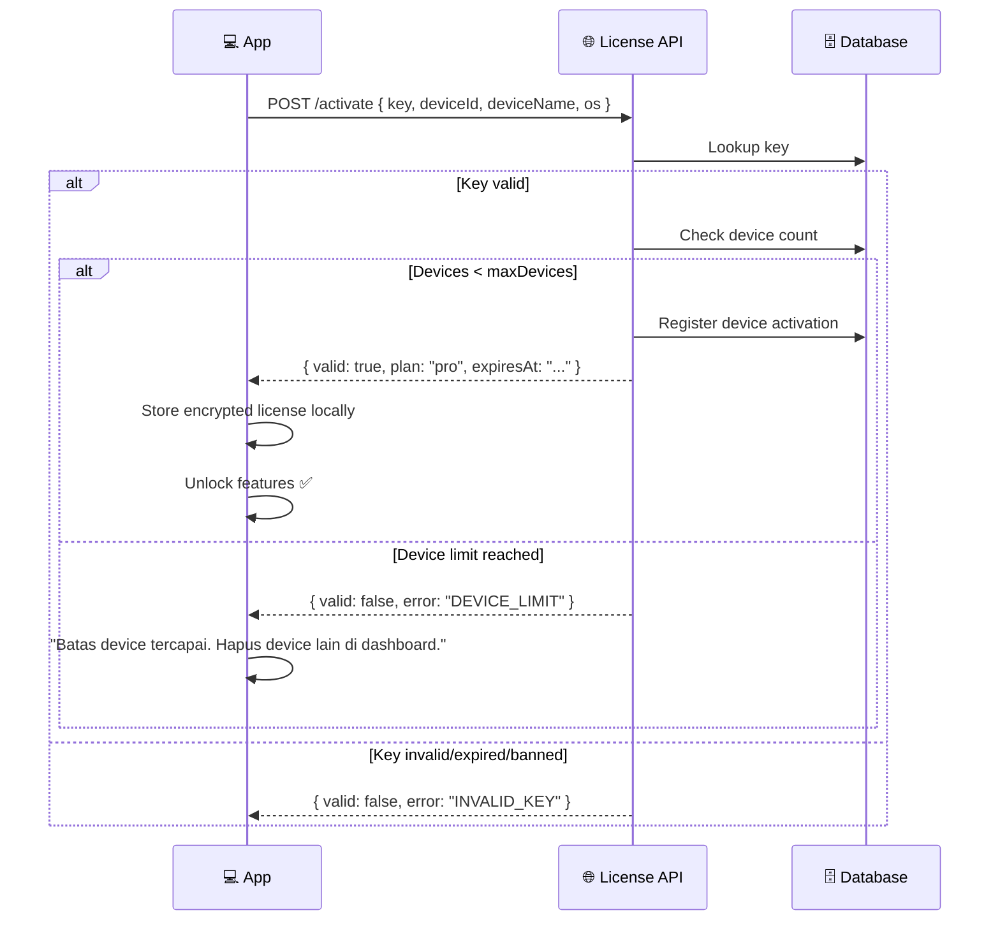
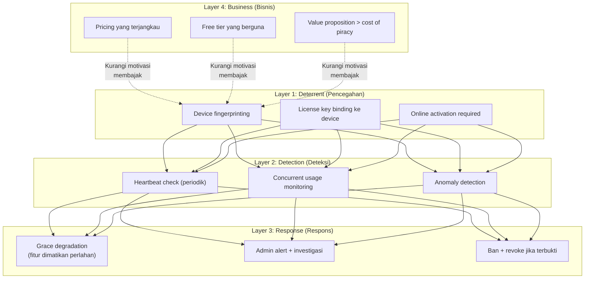
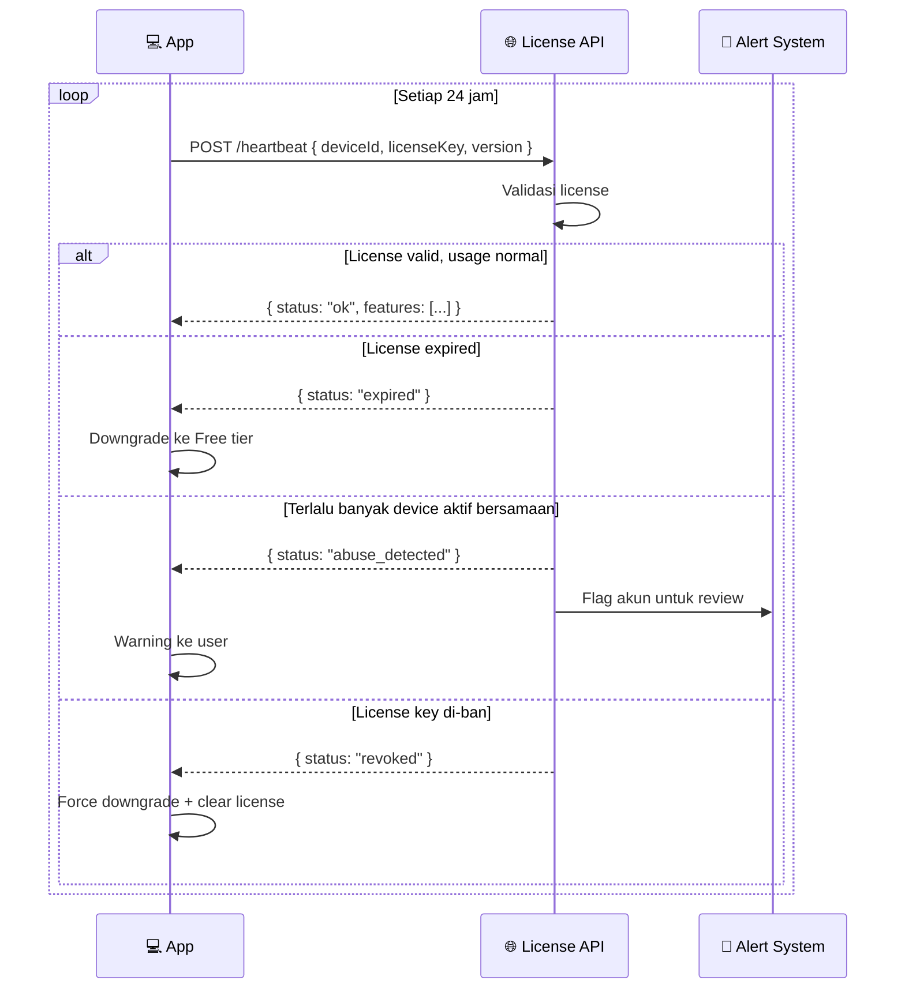
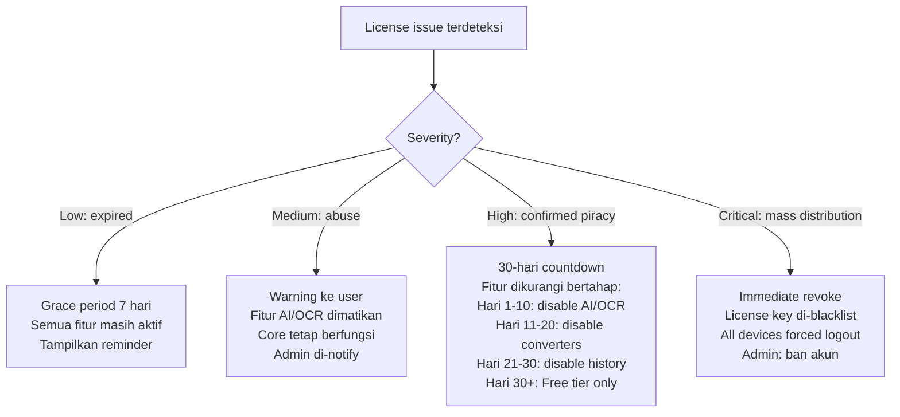
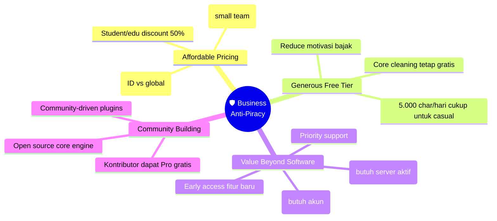
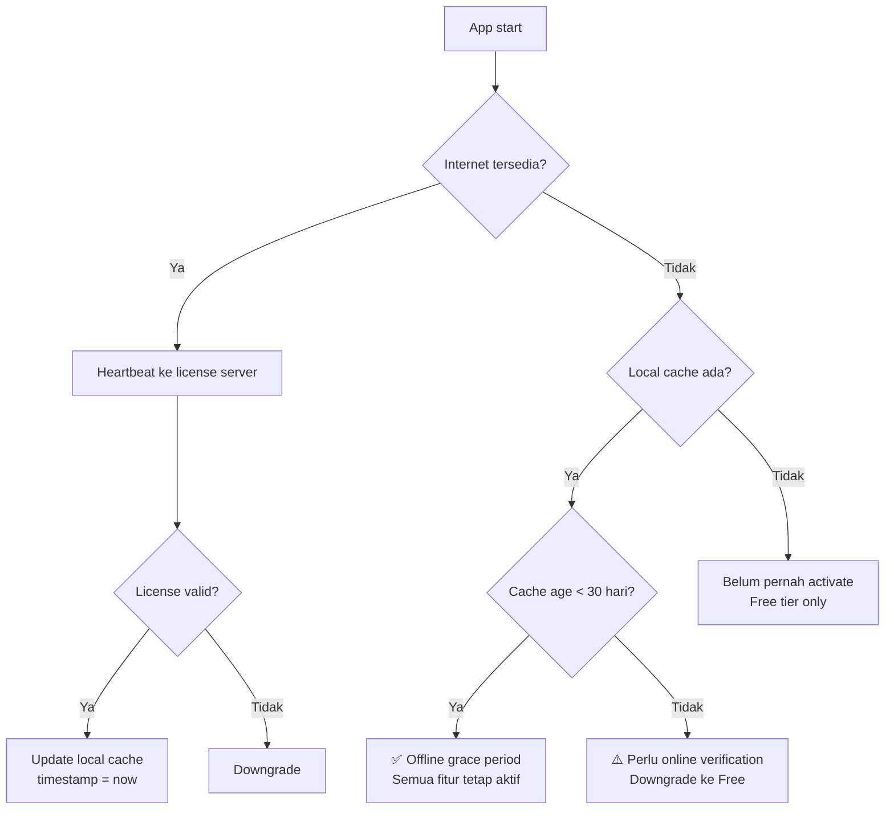

# 15 — Licensing, Langganan & Anti-Pembajakan

## 15.1 Model Bisnis — Subscription vs Lifetime



## 15.2 Arsitektur License Server



## 15.3 Admin Dashboard — Fitur Pengelolaan

### Overview Dashboard

```
┌─────────────────────────────────────────────────────────────┐
│  Smart Paste Hub — Admin Dashboard                          │
├──────────┬──────────────────────────────────────────────────┤
│          │                                                  │
│ 📊 Overview │  ┌──────┐ ┌──────┐ ┌──────┐ ┌──────┐        │
│ 👥 Users    │  │ 1.247│ │  312 │ │   87 │ │ Rp   │        │
│ 💳 Langganan│  │ Total│ │ Pro  │ │ Ulti │ │42.3jt│        │
│ 📦 License  │  │Users │ │Subs  │ │Subs  │ │MRR   │        │
│ 💰 Revenue  │  └──────┘ └──────┘ └──────┘ └──────┘        │
│ 📈 Analytics│                                               │
│ ⚙️ Settings │  📈 Subscription Growth (30 hari terakhir)    │
│ 🚨 Alerts   │  ┌───────────────────────────────────────┐   │
│             │  │ ▄▃▅▆▇▆▅▆▇▇▉█ Pro                     │   │
│             │  │ ▂▂▃▃▄▅▅▅▆▆▇▇ Ultimate                │   │
│             │  └───────────────────────────────────────┘   │
│             │                                               │
│             │  ⚠️ Alerts                                    │
│             │  • 3 license key abuse terdeteksi             │
│             │  • 12 failed payment retries                  │
│             │  • 2 chargeback disputes                      │
└──────────┴──────────────────────────────────────────────────┘
```

### Manajemen Langganan

```
┌─────────────────────────────────────────────────────────────┐
│  💳 Subscription Management                                 │
├─────────────────────────────────────────────────────────────┤
│                                                             │
│  🔍 [Search user / email / license key        ] [🔍 Cari]  │
│  Filter: [Semua ▾] [Status: Active ▾] [Plan: All ▾]       │
│                                                             │
│  ┌─────────────────────────────────────────────────────┐   │
│  │ Email          │ Plan     │ Status  │ Exp. Date  │ ⚙️│   │
│  ├─────────────────────────────────────────────────────┤   │
│  │ adi@mail.com   │ Pro/Yr   │ 🟢 Active│ 2027-02-16│ ⚙️│   │
│  │ sari@mail.com  │ Ultimate │ 🟢 Active│ 2026-08-01│ ⚙️│   │
│  │ budi@mail.com  │ Pro/Mo   │ 🟡 Grace │ 2026-02-20│ ⚙️│   │
│  │ dewi@mail.com  │ Ultimate │ 🔴 Expired│ 2026-01-15│ ⚙️│   │
│  │ rudi@mail.com  │ Pro/Life │ 🟢 Active│ Never     │ ⚙️│   │
│  │ ⚠️ hacker@...  │ Ultimate │ 🚫 Banned│ -         │ ⚙️│   │
│  └─────────────────────────────────────────────────────┘   │
│                                                             │
│  Showing 1-20 of 399  [< Prev] [Next >]                   │
│                                                             │
│  ── Quick Stats ──                                          │
│  Active: 312 │ Grace Period: 15 │ Expired: 72 │ Banned: 3  │
└─────────────────────────────────────────────────────────────┘
```

### Detail User — Admin Actions

```
┌─────────────────────────────────────────────────────────────┐
│  👤 User Detail: adi@mail.com                               │
├─────────────────────────────────────────────────────────────┤
│                                                             │
│  ── Info ──                                                 │
│  Email: adi@mail.com                                        │
│  Plan: Pro (Yearly)                                         │
│  Status: 🟢 Active                                          │
│  Registered: 2026-01-15                                     │
│  Expiry: 2027-02-16                                         │
│  License Key: SPH-PRO-XXXX-XXXX-XXXX                       │
│                                                             │
│  ── Device Activations ──                                   │
│  1. DESKTOP-ADI (Windows 11) — Primary ✓                   │
│  2. MACBOOK-ADI (macOS 14) — 2026-02-01                    │
│  Max devices: 3 │ Used: 2                                   │
│                                                             │
│  ── Payment History ──                                      │
│  2026-02-16 │ Rp 349.000 │ Yearly renewal │ ✅ Paid         │
│  2026-01-16 │ Rp 349.000 │ Initial sub    │ ✅ Paid         │
│                                                             │
│  ── Admin Actions ──                                        │
│  [🔄 Extend 30 hari] [⏸️ Suspend] [🚫 Ban + Revoke]       │
│  [🔑 Reset License Key] [🖥️ Remove Device] [💳 Refund]     │
│  [📧 Send Email] [📝 Add Note]                              │
│                                                             │
│  ── Admin Notes ──                                          │
│  2026-02-10: User request extend, diberikan 7 hari gratis   │
└─────────────────────────────────────────────────────────────┘
```

## 15.4 Admin Actions — Detail

| Action | Deskripsi | Use Case |
|--------|-----------|----------|
| **Extend** | Perpanjang subscription X hari | Kompensasi downtime, promo, CS goodwill |
| **Suspend** | Nonaktifkan sementara (bisa re-activate) | Payment dispute, investigasi abuse |
| **Ban + Revoke** | Banned permanen, revoke semua device | Pembajakan terkonfirmasi |
| **Reset License Key** | Generate key baru, invalidate yang lama | Key bocor / dipakai orang lain |
| **Remove Device** | Hapus aktivasi device tertentu | User ganti laptop, device limit penuh |
| **Refund** | Proses refund via payment gateway | Dispute, ketidakpuasan |
| **Send Email** | Kirim email ke user dari dashboard | Notification, warning |
| **Add Note** | Catatan internal admin | Pelacakan CS interaction |

## 15.5 Subscription Lifecycle



## 15.6 Payment Integration



### Payment Gateway Options

| Gateway | Market | Metode Pembayaran | Biaya |
|---------|--------|-------------------|-------|
| **Stripe** | Global | Kartu kredit, Apple Pay, Google Pay | 2.9% + $0.30 |
| **Midtrans** | Indonesia | GoPay, OVO, DANA, BCA VA, Mandiri, BRI | 0.7% - 2.9% |
| **Xendit** | Southeast Asia | E-wallet, bank transfer, QRIS | 1.5% - 2.9% |

> **Rekomendasi**: Gunakan **Midtrans** untuk pasar Indonesia (e-wallet populer) + **Stripe** untuk pasar global.

## 15.7 License Key System

### Format License Key

```
SPH-[TIER]-[XXXX]-[XXXX]-[XXXX]

Contoh:
  SPH-PRO-A3K9-M7X2-P5N1     (Pro)
  SPH-ULT-B8J4-Q2W6-R9T3     (Ultimate)
  SPH-PLF-C1D5-S4V8-K7L2     (Pro Lifetime)
  SPH-ULF-D6F0-T3U9-H8M4     (Ultimate Lifetime)
```

### Activation Flow



## 15.8 Anti-Pembajakan — Strategi Multi-Layer



### Layer 1: Device Fingerprinting & Binding

```typescript
// src/licensing/device-fingerprint.ts

interface DeviceFingerprint {
  machineId: string;        // Dari OS (WMI di Win, IOPlatformUUID di Mac)
  hostname: string;
  os: string;
  osVersion: string;
  cpuModel: string;
  totalMemory: number;
}

function generateDeviceId(fp: DeviceFingerprint): string {
  // Hash gabungan machineId + hostname + os
  // Toleransi: minor changes (RAM upgrade) tidak breakdown
  const stable = `${fp.machineId}:${fp.hostname}:${fp.os}`;
  return sha256(stable).substring(0, 32);
}

// Max devices per tier:
// Pro:      3 devices
// Ultimate: 5 devices
// Lifetime: 3 devices (Pro) / 5 devices (Ultimate)
```

### Layer 2: Heartbeat & Monitoring



```typescript
// Anti-abuse detection
interface AbuseIndicators {
  // 🚩 Red flags:
  sameKeyOnMoreThanMaxDevices: boolean;   // Key dipakai > device limit
  differentIPsInShortTime: boolean;       // 10+ unique IPs dalam 1 jam
  rapidDeviceRotation: boolean;           // Ganti device > 5x/hari
  keySharedOnline: boolean;               // Key ditemukan di forum/pastebin
}
```

### Layer 3: Graceful Degradation (Bukan Hard Lock)



> [!IMPORTANT]
> **Filosofi: Graceful Degradation, bukan Hard Lock.**
> Jangan pernah membuat app completely unusable — ini membuat user frustrasi dan mendorong penggunaan crack yang lebih agresif. Sebaliknya, kurangi fitur secara bertahap sehingga user merasakan value dari berbayar.

### Layer 4: Business Strategy Anti-Piracy



## 15.9 License Database Schema

```sql
-- ══════════════════════════════
-- LICENSE SERVER DATABASE
-- ══════════════════════════════

CREATE TABLE users (
    id              TEXT PRIMARY KEY,  -- UUID
    email           TEXT UNIQUE NOT NULL,
    name            TEXT,
    created_at      DATETIME NOT NULL DEFAULT CURRENT_TIMESTAMP,
    status          TEXT NOT NULL DEFAULT 'active'
    -- Enum: active, suspended, banned
);

CREATE TABLE subscriptions (
    id              TEXT PRIMARY KEY,
    user_id         TEXT NOT NULL REFERENCES users(id),
    plan            TEXT NOT NULL,     -- free, pro, ultimate
    billing_cycle   TEXT NOT NULL,     -- monthly, yearly, lifetime
    status          TEXT NOT NULL DEFAULT 'active',
    -- Enum: trialing, active, grace_period, expired, cancelled, suspended, banned
    stripe_sub_id   TEXT,
    midtrans_sub_id TEXT,
    started_at      DATETIME NOT NULL,
    expires_at      DATETIME,         -- NULL untuk lifetime
    cancelled_at    DATETIME,
    created_at      DATETIME NOT NULL DEFAULT CURRENT_TIMESTAMP
);

CREATE TABLE license_keys (
    id              TEXT PRIMARY KEY,
    user_id         TEXT NOT NULL REFERENCES users(id),
    subscription_id TEXT NOT NULL REFERENCES subscriptions(id),
    key             TEXT UNIQUE NOT NULL,  -- SPH-PRO-XXXX-XXXX-XXXX
    max_devices     INTEGER NOT NULL DEFAULT 3,
    status          TEXT NOT NULL DEFAULT 'active',
    -- Enum: active, revoked, expired
    created_at      DATETIME NOT NULL DEFAULT CURRENT_TIMESTAMP
);

CREATE TABLE device_activations (
    id              TEXT PRIMARY KEY,
    license_key_id  TEXT NOT NULL REFERENCES license_keys(id),
    device_id       TEXT NOT NULL,         -- Hashed fingerprint
    device_name     TEXT,
    os              TEXT,
    ip_address      TEXT,
    last_heartbeat  DATETIME,
    activated_at    DATETIME NOT NULL DEFAULT CURRENT_TIMESTAMP,
    
    UNIQUE(license_key_id, device_id)
);

CREATE TABLE payment_history (
    id              TEXT PRIMARY KEY,
    user_id         TEXT NOT NULL REFERENCES users(id),
    subscription_id TEXT REFERENCES subscriptions(id),
    amount          INTEGER NOT NULL,      -- Dalam rupiah
    currency        TEXT DEFAULT 'IDR',
    gateway         TEXT,                  -- stripe, midtrans
    gateway_txn_id  TEXT,
    status          TEXT NOT NULL,
    -- Enum: pending, paid, failed, refunded, disputed
    created_at      DATETIME NOT NULL DEFAULT CURRENT_TIMESTAMP
);

CREATE TABLE admin_notes (
    id              TEXT PRIMARY KEY,
    user_id         TEXT NOT NULL REFERENCES users(id),
    admin_email     TEXT NOT NULL,
    note            TEXT NOT NULL,
    created_at      DATETIME NOT NULL DEFAULT CURRENT_TIMESTAMP
);

CREATE TABLE abuse_logs (
    id              TEXT PRIMARY KEY,
    license_key_id  TEXT REFERENCES license_keys(id),
    type            TEXT NOT NULL,
    -- Enum: device_limit_exceeded, rapid_rotation, concurrent_usage,
    --       key_shared_online, suspicious_ip
    details         TEXT,                  -- JSON
    resolved        INTEGER DEFAULT 0,
    created_at      DATETIME NOT NULL DEFAULT CURRENT_TIMESTAMP
);
```

## 15.10 Offline Grace Period



> [!NOTE]
> User yang sah tidak akan terganggu oleh sistem anti-piracy. Verification hanya perlu online **sekali per 30 hari**. Selebihnya app berfungsi penuh secara offline.

---

> 📖 **Kembali ke:** [Daftar Isi](00-daftar-isi.md)
