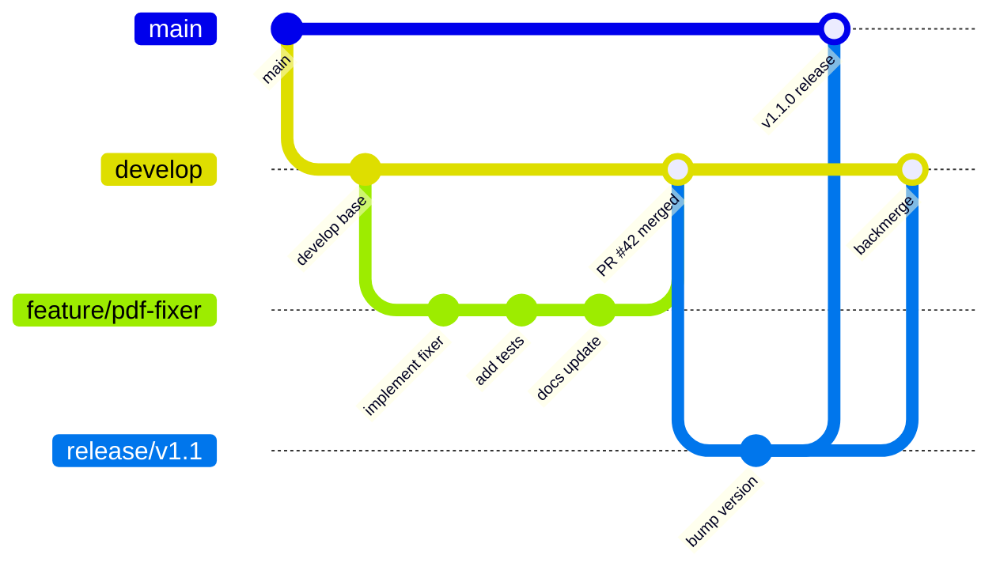

# 17 — Contributing Guide

## 🤝 Selamat Datang, Kontributor!

Terima kasih sudah tertarik berkontribusi di **Smart Paste Hub**! Panduan ini menjelaskan cara berkontribusi — dari setup environment hingga submit Pull Request.

---

## 17.1 Prerequisites

| Tool | Versi | Catatan |
|------|-------|---------|
| **Node.js** | 20 LTS+ | `node -v` untuk cek |
| **npm** | 10+ | Bundled dengan Node.js |
| **Git** | 2.40+ | `git -v` untuk cek |
| **VS Code** | Latest | Recommended editor |

### Recommended VS Code Extensions

- **ESLint** — linting real-time
- **Prettier** — auto-format
- **EditorConfig** — consistent formatting
- **Vitest** — test integration
- **Mermaid Preview** — preview diagram di docs

## 17.2 Setup Development Environment

```bash
# 1. Fork & clone
git clone https://github.com/YOUR_USERNAME/smartpastehub.git
cd smartpastehub

# 2. Install dependencies
npm install

# 3. Jalankan di development mode
npm run dev

# 4. Jalankan tests
npm test

# 5. Lint check
npm run lint
```

## 17.3 Git Workflow



### Branch Naming

| Tipe | Format | Contoh |
|------|--------|--------|
| Feature | `feature/nama-fitur` | `feature/table-converter` |
| Bug fix | `fix/deskripsi-bug` | `fix/pdf-linebreak-crash` |
| Documentation | `docs/topik` | `docs/api-reference` |
| Performance | `perf/area` | `perf/cleaning-pipeline` |
| Refactor | `refactor/area` | `refactor/content-detector` |
| Test | `test/area` | `test/security-masker` |

## 17.4 Commit Convention

Kami menggunakan **Conventional Commits** format:

```
<type>(<scope>): <description>

[optional body]

[optional footer]
```

### Types

| Type | Emoji | Penggunaan |
|------|-------|------------|
| `feat` | ✨ | Fitur baru |
| `fix` | 🐛 | Bug fix |
| `docs` | 📝 | Dokumentasi |
| `style` | 💄 | Formatting (tanpa logic change) |
| `refactor` | ♻️ | Refactoring code |
| `test` | ✅ | Tambah/perbaiki test |
| `perf` | ⚡ | Performance improvement |
| `chore` | 🔧 | Build, tooling, deps |
| `ci` | 👷 | CI/CD changes |
| `revert` | ⏪ | Revert commit sebelumnya |

### Contoh

```
feat(core): add PDF line-break detection heuristic

Implement heuristic to detect PDF-style line wraps and merge
them into proper paragraphs. Uses line length analysis and
punctuation detection.

Closes #15
```

```
fix(security): prevent false positive on 16-digit order numbers

Order numbers like "2026021612345678" were being detected as
NIK. Added context check for common prefixes.

Fixes #23
```

## 17.5 Pull Request Guidelines

### PR Template

```markdown
## Deskripsi
<!-- Jelaskan perubahan yang dibuat -->

## Jenis Perubahan
- [ ] ✨ Fitur baru
- [ ] 🐛 Bug fix
- [ ] 📝 Dokumentasi
- [ ] ♻️ Refactoring
- [ ] ⚡ Performance
- [ ] ✅ Test

## Checklist
- [ ] Tests lulus (`npm test`)
- [ ] Lint bersih (`npm run lint`)
- [ ] Dokumentasi diperbarui (jika perlu)
- [ ] Commit sesuai konvensi
- [ ] Screenshots (jika ada perubahan UI)

## Screenshots (jika ada)
<!-- Sertakan before/after -->

## Related Issues
<!-- Closes #XX, Fixes #YY -->
```

### Review Criteria

| Aspek | Pertanyaan |
|-------|-----------|
| **Correctness** | Apakah kode benar dan menyelesaikan masalah? |
| **Tests** | Apakah ada unit test untuk logic baru? |
| **Performance** | Apakah perubahan mempertahankan performance budget? |
| **Security** | Apakah ada risiko keamanan dari perubahan ini? |
| **Style** | Apakah konsisten dengan codebase yang ada? |
| **i18n** | Apakah string baru di-translate (id/en)? |
| **a11y** | Apakah elemen baru accessible via keyboard? |

## 17.6 Code Style

### TypeScript

```typescript
// ✅ Good
function cleanContent(text: string, options?: CleanOptions): CleanResult {
  const type = detectContentType(text);
  return applyPreset(text, type, options);
}

// ❌ Bad — tanpa type, tanpa deskriptif naming
function clean(t: any, o: any) {
  const x = detect(t);
  return apply(t, x, o);
}
```

### Aturan Umum

- **Type everything** — Hindari `any`, gunakan `unknown` jika perlu
- **Functional by default** — Prefer pure functions, hindari side effects
- **Early return** — Hindari nested if/else yang dalam
- **Small functions** — Maks ~30 baris, single responsibility
- **Descriptive names** — `detectContentType` > `detect` > `d`
- **Error handling** — Selalu handle error, jangan silent catch
- **No magic strings** — Gunakan enum atau constants

### File Organization

```typescript
// Urutan dalam file:
// 1. Imports (external → internal → types)
// 2. Constants / Enums
// 3. Types / Interfaces
// 4. Helper functions (private)
// 5. Main exported functions / classes
// 6. Default export (jika ada)
```

## 17.7 Kontribusi Selain Kode

| Tipe | Cara |
|------|------|
| 🐛 **Bug Report** | Buka Issue dengan template "Bug Report" |
| 💡 **Feature Request** | Buka Issue dengan template "Feature Request" |
| 📝 **Dokumentasi** | Edit file di `docs/`, submit PR |
| 🌍 **Terjemahan** | Tambah/perbaiki file di `src/locales/` |
| 🧪 **Testing** | Tambah test cases, terutama untuk edge cases |
| 🔌 **Plugin** | Buat plugin, publish, daftarkan di plugin store |
| 🎨 **UI/UX** | Buat design mockup, diskusi di Issue |
| 📊 **Performance** | Profile, identifikasi bottleneck, submit PR |

## 17.8 Issue Templates

### Bug Report

```markdown
**Deskripsi Bug**
<!-- Jelaskan bug yang ditemukan -->

**Langkah Reproduksi**
1. Buka aplikasi
2. Copy teks dari '...'
3. Tekan Ctrl+Alt+V
4. Lihat hasil...

**Expected Behavior**
<!-- Apa yang seharusnya terjadi -->

**Actual Behavior**
<!-- Apa yang sebenarnya terjadi -->

**Environment**
- OS: [Windows 11 / macOS 14 / Ubuntu 24.04]
- Smart Paste Hub: [v1.0.0]
- Sumber clipboard: [Word / Chrome / PDF / ...]

**Screenshots / Logs**
<!-- Sertakan jika ada -->
```

## 17.9 License

Proyek ini menggunakan **dual license**:

- **Core Engine** (`src/core/`) — MIT License (open source)
- **Pro/Ultimate Features** (`src/ai/`, `src/sync/`) — Proprietary

Kontribusi ke `src/core/` akan dilisensikan di bawah MIT.

---

> 📖 **Kembali ke:** [Daftar Isi](00-daftar-isi.md)
